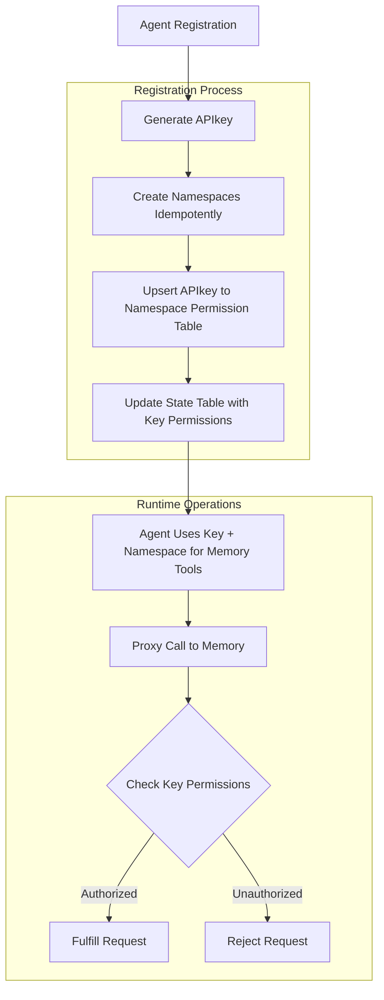

# Namespaces

These are logical boundaries between memory networks that allow for more complex memory models to be implemented.

## Workflow

Registration Example

```yaml
    name: architect-agent
    namespace: project1
    shared_namespaces:
        - project2
```



This would:
- Produce an APIkey
- Any defined namespaces are idempotently created
- Idempotent upsert of APIkey to namespace permission backend lookup table
- Each key updates a state table of keys that is a simple list of namespaces and permissions they have to them.
- Agent then uses key + namespace (defaults to primary) for all memory tools
- Each proxy call to memory checks the key to namespace table for determining if it can fulfill a request to one or more defined namespaces.

## Namespace Segmentation


| Namespace | SQLite Filter | Qdrant Collection Filter |
|-----------|---------------|-------------------------|
| `user-123` | `WHERE namespace = 'user-123'` | `collection_name = "memory_user_123"` |
| `project-alpha` | `WHERE namespace = 'project-alpha'` | `collection_name = "memory_project_alpha"` |
| `team-dev` | `WHERE namespace = 'team-dev'` | `collection_name = "memory_team_dev"` |
| `global-shared` | `WHERE namespace = 'global-shared'` | `collection_name = "memory_global_shared"` |
| `client-corp` | `WHERE namespace = 'client-corp'` | `collection_name = "memory_client_corp"` |

