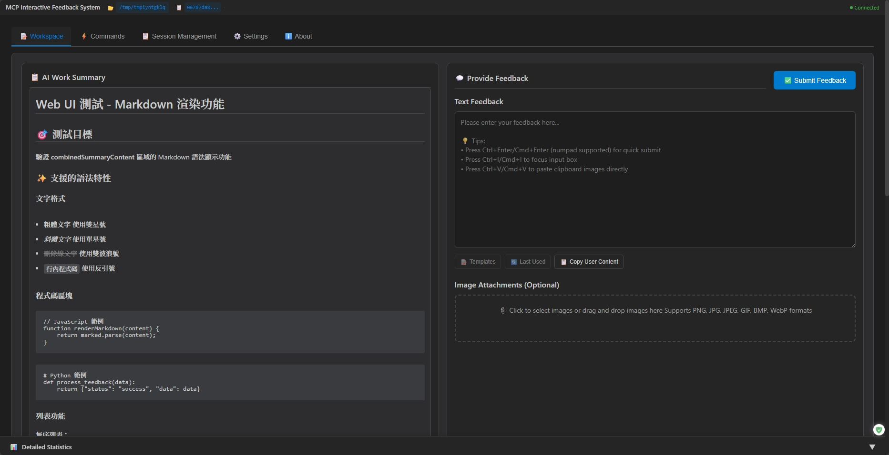
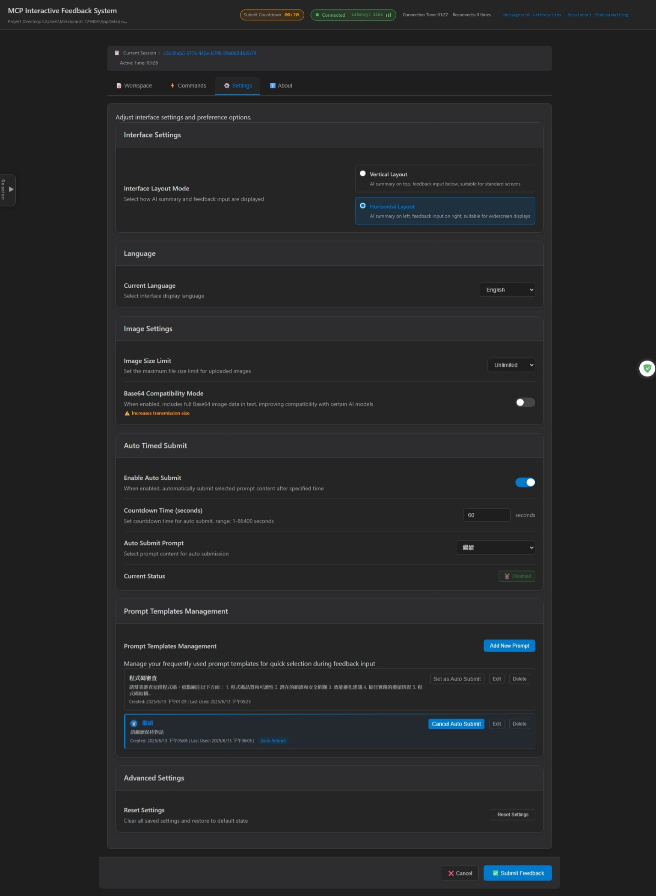
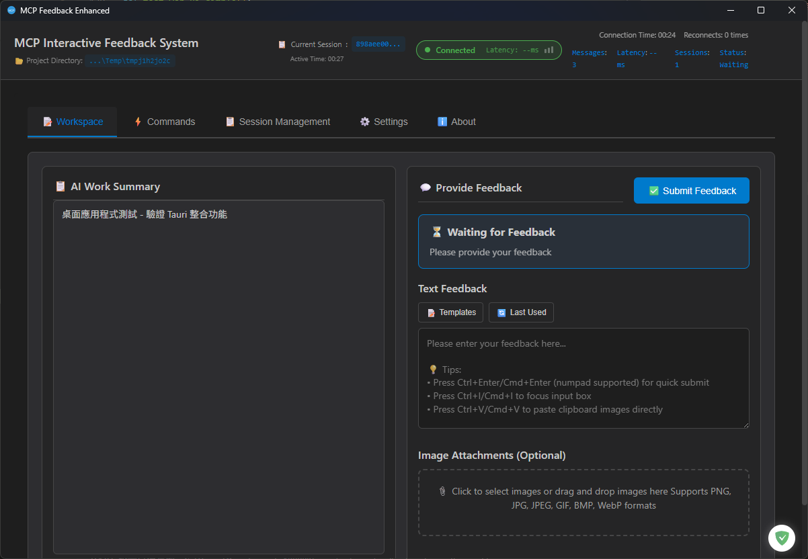

# MCP Feedback Enhanced

**🌐 Language / 語言切換:** **English** | [繁體中文](README.zh-TW.md) | [简体中文](README.zh-CN.md)

**Original Author:** [Fábio Ferreira](https://x.com/fabiomlferreira) | [Original Project](https://github.com/noopstudios/interactive-feedback-mcp) ⭐
**Enhanced Fork:** [Minidoracat](https://github.com/Minidoracat)
**UI Design Reference:** [sanshao85/mcp-feedback-collector](https://github.com/sanshao85/mcp-feedback-collector)

## 🎯 Core Concept

This is an [MCP server](https://modelcontextprotocol.io/) that establishes **feedback-oriented development workflows**, providing **Web UI and Desktop Application** dual interface options, perfectly adapting to local, **SSH Remote environments**, and **WSL (Windows Subsystem for Linux) environments**. By guiding AI to confirm with users rather than making speculative operations, it can consolidate multiple tool calls into a single feedback-oriented request, dramatically reducing platform costs and improving development efficiency.

**🌐 Dual Interface Architecture Advantages:**
- 🖥️ **Desktop Application**: Native cross-platform desktop experience, supporting Windows, macOS, Linux
- 🌐 **Web UI**: No GUI dependencies required, suitable for remote and WSL environments
- 🔧 **Flexible Deployment**: Choose the most suitable interface mode based on environment requirements
- 📦 **Unified Functionality**: Both interfaces provide exactly the same functional experience

**🖥️ Desktop Application:** v2.5.0 introduces cross-platform desktop application support based on Tauri framework, supporting Windows, macOS, and Linux platforms with native desktop experience.

**Supported Platforms:** [Cursor](https://www.cursor.com) | [Cline](https://cline.bot) | [Windsurf](https://windsurf.com) | [Augment](https://www.augmentcode.com) | [Trae](https://www.trae.ai)

### 🔄 Workflow
1. **AI Call** → `mcp-feedback-enhanced` tool
2. **Interface Launch** → Auto-open desktop application or browser interface (based on configuration)
3. **Smart Interaction** → Prompt selection, text input, image upload, auto-submit
4. **Real-time Feedback** → WebSocket connection delivers information to AI instantly
5. **Session Tracking** → Auto-record session history and statistics
6. **Process Continuation** → AI adjusts behavior or ends task based on feedback

## 🌟 Key Features

### 🖥️ Dual Interface Support
- **Desktop Application**: Cross-platform native application based on Tauri, supporting Windows, macOS, Linux
- **Web UI Interface**: Lightweight browser interface suitable for remote and WSL environments
- **Automatic Environment Detection**: Intelligently recognizes SSH Remote, WSL and other special environments
- **Unified Feature Experience**: Both interfaces provide exactly the same functionality

### 📝 Smart Workflow
- **Prompt Management**: CRUD operations for common prompts, usage statistics, intelligent sorting
- **Auto-Timed Submit**: 1-86400 second flexible timer, supports pause, resume, cancel with new pause/resume button controls
- **Auto Command Execution** (v2.6.0): Automatically execute preset commands after creating new sessions or commits for improved development efficiency
- **Session Management & Tracking**: Local file storage, privacy controls, history export (supports JSON, CSV, Markdown formats), real-time statistics, flexible timeout settings
- **Connection Monitoring**: WebSocket status monitoring, auto-reconnection, quality indicators
- **AI Work Summary Markdown Display**: Support for rich Markdown syntax rendering including headers, bold text, code blocks, lists, links and other formats for enhanced content readability

### 🎨 Modern Experience
- **Responsive Design**: Adapts to different screen sizes, modular JavaScript architecture
- **Audio Notifications**: Built-in multiple sound effects, custom audio upload support, volume control
- **System Notifications** (v2.6.0): System-level real-time alerts for important events (like auto-commit, session timeout)
- **Smart Memory**: Input box height memory, one-click copy, persistent settings
- **Multi-language Support**: Traditional Chinese, English, Simplified Chinese, instant switching

### 🖼️ Images & Media
- **Full Format Support**: PNG, JPG, JPEG, GIF, BMP, WebP
- **Convenient Upload**: Drag & drop files, clipboard paste (Ctrl+V)
- **Unlimited Processing**: Support for any size images, automatic intelligent processing

## 🌐 Interface Preview

### Web UI Interface (v2.5.0 - Desktop Application Support)

<div align="center">
  
</div>

<details>
<summary>📱 Click to view complete interface screenshots</summary>

<div align="center">
  
</div>

</details>

*Web UI Interface - Supports desktop application and Web interface, providing prompt management, auto-submit, session tracking and other smart features*

### Desktop Application Interface (v2.5.0 New Feature)

<div align="center">
  
</div>

*Desktop Application - Native cross-platform desktop application based on Tauri framework, supporting Windows, macOS, Linux with exactly the same functionality as Web UI*

**Shortcut Support**
- `Ctrl+Enter`（Windows/Linux）/ `Cmd+Enter`（macOS）：Submit feedback (both main keyboard and numeric keypad supported)
- `Ctrl+V`（Windows/Linux）/ `Cmd+V`（macOS）：Direct paste clipboard images
- `Ctrl+I`（Windows/Linux）/ `Cmd+I`（macOS）：Quick focus input box (Thanks @penn201500)

## 🚀 Quick Start

### 1. Installation & Testing
```bash
# Install uv (if not already installed)
pip install uv
```

### 2. Configure MCP
**Basic Configuration** (suitable for most users):
```json
{
  "mcpServers": {
    "mcp-feedback-enhanced": {
      "command": "uvx",
      "args": ["mcp-feedback-enhanced@latest"],
      "timeout": 600,
      "autoApprove": ["interactive_feedback"]
    }
  }
}
```

**Advanced Configuration** (requires custom environment):
```json
{
  "mcpServers": {
    "mcp-feedback-enhanced": {
      "command": "uvx",
      "args": ["mcp-feedback-enhanced@latest"],
      "timeout": 600,
      "env": {
        "MCP_DEBUG": "false",
        "MCP_WEB_HOST": "127.0.0.1",
        "MCP_WEB_PORT": "8765",
        "MCP_LANGUAGE": "en"
      },
      "autoApprove": ["interactive_feedback"]
    }
  }
}
```

**Desktop Application Configuration** (v2.5.0 new feature - using native desktop application):
```json
{
  "mcpServers": {
    "mcp-feedback-enhanced": {
      "command": "uvx",
      "args": ["mcp-feedback-enhanced@latest"],
      "timeout": 600,
      "env": {
        "MCP_DESKTOP_MODE": "true",
        "MCP_WEB_HOST": "127.0.0.1",
        "MCP_WEB_PORT": "8765",
        "MCP_DEBUG": "false"
      },
      "autoApprove": ["interactive_feedback"]
    }
  }
}
```

**Configuration File Examples**:
- Desktop Mode: [examples/mcp-config-desktop.json](examples/mcp-config-desktop.json)
- Web Mode: [examples/mcp-config-web.json](examples/mcp-config-web.json)

### 🐳 Docker Deployment (HTTP Mode)

Run the MCP server in HTTP mode using Docker for easy deployment:

```bash
# Quick start with Docker Compose
docker compose up -d

# Or build and run manually
docker build -t mcp-feedback-enhanced .
docker run -d \
  --name mcp-feedback \
  -p 8765:8765 \
  -e MCP_TRANSPORT=sse \
  -e MCP_WEB_HOST=0.0.0.0 \
  mcp-feedback-enhanced
```

Access the Web UI at: `http://localhost:8765`

**Supported HTTP Transports:**
- **SSE (Server-Sent Events)**: Recommended for most use cases
- **Streamable HTTP**: Alternative HTTP streaming protocol

📖 **Full Docker Documentation**: [docs/DOCKER.md](docs/DOCKER.md)

### 3. Prompt Engineering Setup
For optimal results, add the following rules to your AI assistant:

```
# MCP Interactive Feedback Rules

follow mcp-feedback-enhanced instructions
```

## ⚙️ Advanced Settings

### Environment Variables
| Variable | Purpose | Values | Default |
|----------|---------|--------|---------|
| `MCP_DEBUG` | Debug mode | `true`/`false` | `false` |
| `MCP_WEB_HOST` | Web UI host binding | IP address or hostname | `127.0.0.1` |
| `MCP_WEB_PORT` | Web UI port | `1024-65535` | `8765` |
| `MCP_DESKTOP_MODE` | Desktop application mode | `true`/`false` | `false` |
| `MCP_LANGUAGE` | Force UI language | `zh-TW`/`zh-CN`/`en` | Auto-detect |
| `MCP_TRANSPORT` | Transport protocol (HTTP mode) | `stdio`/`sse`/`streamable-http` | `stdio` |

**`MCP_WEB_HOST` Explanation**:
- `127.0.0.1` (default): Local access only, higher security
- `0.0.0.0`: Allow remote access, suitable for SSH remote development and **Docker deployments**

**`MCP_TRANSPORT` Explanation** (Docker/HTTP mode):
- `stdio` (default): Standard MCP communication for local clients
- `sse`: Server-Sent Events for HTTP mode (recommended for Docker)
- `streamable-http`: Alternative HTTP streaming protocol
- **Note**: HTTP transports automatically disable desktop mode

**`MCP_LANGUAGE` Explanation**:
- Used to force the interface language, overriding automatic system detection
- Supported language codes:
  - `zh-TW`: Traditional Chinese
  - `zh-CN`: Simplified Chinese
  - `en`: English
- Language detection priority:
  1. User-saved language settings in the interface (highest priority)
  2. `MCP_LANGUAGE` environment variable
  3. System environment variables (LANG, LC_ALL, etc.)
  4. System default language
  5. Fallback to default language (Traditional Chinese)

### Testing Options
```bash
# Version check
uvx mcp-feedback-enhanced@latest version       # Check version

# Interface testing
uvx mcp-feedback-enhanced@latest test --web    # Test Web UI (auto continuous running)
uvx mcp-feedback-enhanced@latest test --desktop # Test desktop application (v2.5.0 new feature)

# Debug mode
MCP_DEBUG=true uvx mcp-feedback-enhanced@latest test

# Specify language for testing
MCP_LANGUAGE=en uvx mcp-feedback-enhanced@latest test --web    # Force English interface
MCP_LANGUAGE=zh-TW uvx mcp-feedback-enhanced@latest test --web  # Force Traditional Chinese
MCP_LANGUAGE=zh-CN uvx mcp-feedback-enhanced@latest test --web  # Force Simplified Chinese
```

### Developer Installation
```bash
git clone https://github.com/Minidoracat/mcp-feedback-enhanced.git
cd mcp-feedback-enhanced
uv sync
```

**Local Testing Methods**
```bash
# Functional testing
make test-func                                           # Standard functional testing
make test-web                                            # Web UI testing (continuous running)
make test-desktop-func                                   # Desktop application functional testing

# Or use direct commands
uv run python -m mcp_feedback_enhanced test              # Standard functional testing
uvx --no-cache --with-editable . mcp-feedback-enhanced test --web   # Web UI testing (continuous running)
uvx --no-cache --with-editable . mcp-feedback-enhanced test --desktop # Desktop application testing

# Desktop application build (v2.5.0 new feature)
make build-desktop                                       # Build desktop application (debug mode)
make build-desktop-release                               # Build desktop application (release mode)
make test-desktop                                        # Test desktop application
make clean-desktop                                       # Clean desktop build artifacts

# Unit testing
make test                                                # Run all unit tests
make test-fast                                          # Fast testing (skip slow tests)
make test-cov                                           # Test and generate coverage report

# Code quality checks
make check                                              # Complete code quality check
make quick-check                                        # Quick check and auto-fix
```

**Testing Descriptions**
- **Functional Testing**: Test complete MCP tool functionality workflow
- **Unit Testing**: Test individual module functionality
- **Coverage Testing**: Generate HTML coverage report to `htmlcov/` directory
- **Quality Checks**: Include linting, formatting, type checking

## 🆕 Version History

📋 **Complete Version History:** [RELEASE_NOTES/CHANGELOG.en.md](RELEASE_NOTES/CHANGELOG.en.md)

### Latest Version Highlights (v2.6.0)
- 🚀 **Auto Command Execution**: Automatically execute preset commands after creating new sessions or commits, improving workflow efficiency
- 📊 **Session Export Feature**: Support exporting session records to multiple formats for easy sharing and archiving
- ⏸️ **Auto-commit Control**: Added pause and resume buttons for better control over auto-commit timing
- 🔔 **System Notifications**: System-level notifications for important events with real-time alerts
- ⏱️ **Session Timeout Optimization**: Redesigned session management with more flexible configuration options
- 🌏 **I18n Enhancement**: Refactored internationalization architecture with full multilingual support for notifications
- 🎨 **UI Simplification**: Significantly simplified user interface for improved user experience

## 🐛 Common Issues

### 🌐 SSH Remote Environment Issues
**Q: Browser cannot launch or access in SSH Remote environment**
A: Two solutions available:

**Solution 1: Environment Variable Setting (v2.5.5 Recommended)**
Set `"MCP_WEB_HOST": "0.0.0.0"` in MCP configuration to allow remote access:
```json
{
  "mcpServers": {
    "mcp-feedback-enhanced": {
      "command": "uvx",
      "args": ["mcp-feedback-enhanced@latest"],
      "timeout": 600,
      "env": {
        "MCP_WEB_HOST": "0.0.0.0",
        "MCP_WEB_PORT": "8765"
      },
      "autoApprove": ["interactive_feedback"]
    }
  }
}
```
Then open in local browser: `http://[remote-host-IP]:8765`

**Solution 2: SSH Port Forwarding (Traditional Method)**
1. Use default configuration (`MCP_WEB_HOST`: `127.0.0.1`)
2. Set up SSH port forwarding:
   - **VS Code Remote SSH**: Press `Ctrl+Shift+P` → "Forward a Port" → Enter `8765`
   - **Cursor SSH Remote**: Manually add port forwarding rule (port 8765)
3. Open in local browser: `http://localhost:8765`

For detailed solutions, refer to: [SSH Remote Environment Usage Guide](docs/en/ssh-remote/browser-launch-issues.md)

**Q: Why am I not receiving new MCP feedback?**
A: Likely a WebSocket connection issue. **Solution**: Directly refresh the browser page.

**Q: Why isn't MCP being called?**
A: Please confirm MCP tool status shows green light. **Solution**: Repeatedly toggle MCP tool on/off, wait a few seconds for system reconnection.

**Q: Augment cannot start MCP**
A: **Solution**: Completely close and restart VS Code or Cursor, reopen the project.

### 🔧 General Issues
**Q: How to use desktop application?**
A: v2.5.0 introduces cross-platform desktop application support. Set `"MCP_DESKTOP_MODE": "true"` in MCP configuration to enable:
```json
{
  "mcpServers": {
    "mcp-feedback-enhanced": {
      "command": "uvx",
      "args": ["mcp-feedback-enhanced@latest"],
      "timeout": 600,
      "env": {
        "MCP_DESKTOP_MODE": "true",
        "MCP_WEB_PORT": "8765"
      },
      "autoApprove": ["interactive_feedback"]
    }
  }
}
```
**Configuration File Example**: [examples/mcp-config-desktop.json](examples/mcp-config-desktop.json)

**Q: How to use legacy PyQt6 GUI interface?**
A: v2.4.0 completely removed PyQt6 GUI dependencies. To use legacy GUI, specify v2.3.0 or earlier: `uvx mcp-feedback-enhanced@2.3.0`
**Note**: Legacy versions don't include new features (prompt management, auto-submit, session management, desktop application, etc.).

**Q: "Unexpected token 'D'" error appears**
A: Debug output interference. Set `MCP_DEBUG=false` or remove the environment variable.

**Q: Chinese character garbled text**
A: Fixed in v2.0.3. Update to latest version: `uvx mcp-feedback-enhanced@latest`

**Q: Window disappears or positioning errors in multi-screen environment**
A: Fixed in v2.1.1. Go to "⚙️ Settings" tab, check "Always show window at primary screen center" to resolve. Especially suitable for T-shaped screen arrangements and other complex multi-screen configurations.

**Q: Image upload failure**
A: Check file format (PNG/JPG/JPEG/GIF/BMP/WebP). System supports any size image files.

**Q: Web UI cannot start**
A: Check firewall settings or try using different ports.

**Q: UV Cache occupies too much disk space**
A: Due to frequent use of `uvx` commands, cache may accumulate to tens of GB. Regular cleanup recommended:
```bash
# View cache size and detailed information
python scripts/cleanup_cache.py --size

# Preview cleanup content (no actual cleanup)
python scripts/cleanup_cache.py --dry-run

# Execute standard cleanup
python scripts/cleanup_cache.py --clean

# Force cleanup (attempts to close related programs, solving Windows file occupation issues)
python scripts/cleanup_cache.py --force

# Or directly use uv command
uv cache clean
```
For detailed instructions, refer to: [Cache Management Guide](docs/en/cache-management.md)

**Q: AI models cannot parse images**
A: Various AI models (including Gemini Pro 2.5, Claude, etc.) may have instability in image parsing, sometimes correctly recognizing and sometimes unable to parse uploaded image content. This is a known limitation of AI visual understanding technology. Recommendations:
1. Ensure good image quality (high contrast, clear text)
2. Try uploading multiple times, retries usually succeed
3. If parsing continues to fail, try adjusting image size or format

## 🙏 Acknowledgments

### 🌟 Support Original Author
**Fábio Ferreira** - [X @fabiomlferreira](https://x.com/fabiomlferreira)
**Original Project:** [noopstudios/interactive-feedback-mcp](https://github.com/noopstudios/interactive-feedback-mcp)

If you find it useful, please:
- ⭐ [Star the original project](https://github.com/noopstudios/interactive-feedback-mcp)
- 📱 [Follow the original author](https://x.com/fabiomlferreira)

### Design Inspiration
**sanshao85** - [mcp-feedback-collector](https://github.com/sanshao85/mcp-feedback-collector)

### Contributors
**penn201500** - [GitHub @penn201500](https://github.com/penn201500)
- 🎯 Auto-focus input box feature ([PR #39](https://github.com/Minidoracat/mcp-feedback-enhanced/pull/39))

**leo108** - [GitHub @leo108](https://github.com/leo108)
- 🌐 SSH Remote Development Support (`MCP_WEB_HOST` environment variable) ([PR #113](https://github.com/Minidoracat/mcp-feedback-enhanced/pull/113))

**Alsan** - [GitHub @Alsan](https://github.com/Alsan)
- 🍎 macOS PyO3 Compilation Configuration Support ([PR #93](https://github.com/Minidoracat/mcp-feedback-enhanced/pull/93))

**fireinice** - [GitHub @fireinice](https://github.com/fireinice)
- 📝 Tool Documentation Optimization (LLM instructions moved to docstring) ([PR #105](https://github.com/Minidoracat/mcp-feedback-enhanced/pull/105))

### Community Support
- **Discord:** [https://discord.gg/Gur2V67](https://discord.gg/Gur2V67)
- **Issues:** [GitHub Issues](https://github.com/Minidoracat/mcp-feedback-enhanced/issues)

## 📄 License

MIT License - See [LICENSE](LICENSE) file for details

## 📈 Star History

[](https://star-history.com/#Minidoracat/mcp-feedback-enhanced&Date)

---
**🌟 Welcome to Star and share with more developers!**
