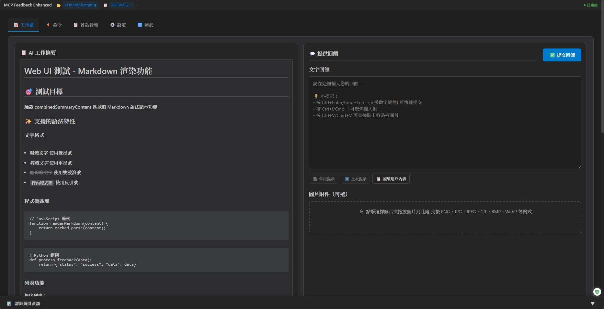
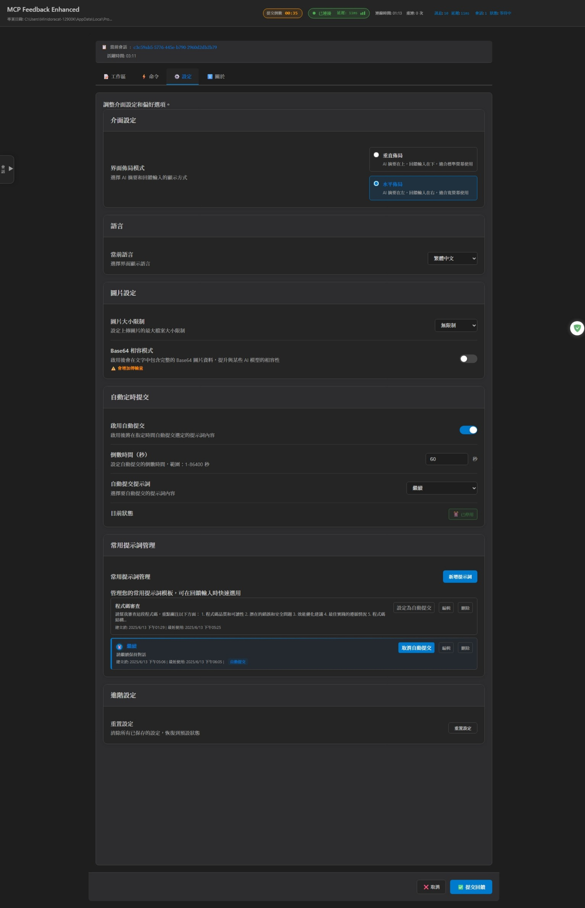
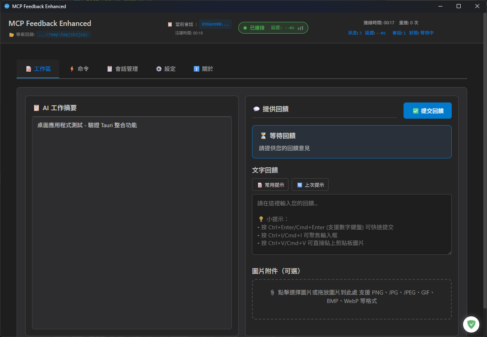

# MCP Feedback Enhanced（互動回饋 MCP）

**🌐 語言切換 / Language:** [English](README.md) | **繁體中文** | [简体中文](README.zh-CN.md)

**原作者：** [Fábio Ferreira](https://x.com/fabiomlferreira) | [原始專案](https://github.com/noopstudios/interactive-feedback-mcp) ⭐
**分支版本：** [Minidoracat](https://github.com/Minidoracat)
**UI 設計參考：** [sanshao85/mcp-feedback-collector](https://github.com/sanshao85/mcp-feedback-collector)

## 🎯 核心概念

這是一個 [MCP 伺服器](https://modelcontextprotocol.io/)，建立**回饋導向的開發工作流程**，提供**Web UI 和桌面應用程式**雙重選擇，完美適配本地、**SSH 遠端開發環境**與 **WSL (Windows Subsystem for Linux) 環境**。透過引導 AI 與用戶確認而非進行推測性操作，可將多次工具調用合併為單次回饋導向請求，大幅節省平台成本並提升開發效率。

**🌐 雙重介面架構優勢：**
- 🖥️ **桌面應用程式**：原生跨平台桌面體驗，支援 Windows、macOS、Linux
- 🌐 **Web UI 介面**：無需 GUI 依賴，適合遠端和 WSL 環境
- 🔧 **靈活部署**：根據環境需求選擇最適合的介面模式
- 📦 **統一功能**：兩種介面提供完全相同的功能體驗

**🖥️ 桌面應用程式：** v2.5.0 新增跨平台桌面應用程式支援，基於 Tauri 框架，支援 Windows、macOS、Linux 三大平台，提供原生桌面體驗。

**支援平台：** [Cursor](https://www.cursor.com) | [Cline](https://cline.bot) | [Windsurf](https://windsurf.com) | [Augment](https://www.augmentcode.com) | [Trae](https://www.trae.ai)

### 🔄 工作流程
1. **AI 調用** → `mcp-feedback-enhanced` 工具
2. **介面啟動** → 自動開啟桌面應用程式或瀏覽器介面（根據配置）
3. **智能互動** → 提示詞選擇、文字輸入、圖片上傳、自動提交
4. **即時回饋** → WebSocket 連線即時傳遞資訊給 AI
5. **會話追蹤** → 自動記錄會話歷史與統計
6. **流程繼續** → AI 根據回饋調整行為或結束任務

## 🌟 主要功能

### 🖥️ 雙重介面支援
- **桌面應用程式**：基於 Tauri 的跨平台原生應用，支援 Windows、macOS、Linux
- **Web UI 介面**：輕量級瀏覽器介面，適合遠端和 WSL 環境
- **環境自動檢測**：智能識別 SSH Remote、WSL 等特殊環境
- **統一功能體驗**：兩種介面提供完全相同的功能

### 📝 智能工作流程
- **提示詞管理**：常用提示詞的 CRUD 操作、使用統計、智能排序
- **自動定時提交**：1-86400 秒彈性計時器，支援暫停、恢復、取消，新增暫停/開始按鈕控制
- **自動執行命令**（v2.6.0）：新建會話和提交後可自動執行預設命令，提升開發效率
- **會話管理追蹤**：本地檔案存儲、隱私控制、歷史匯出（支援 JSON、CSV、Markdown 格式）、即時統計、彈性超時設定
- **連線監控**：WebSocket 狀態監控、自動重連、品質指示
- **AI 工作摘要 Markdown 顯示**：支援豐富的 Markdown 語法渲染，包含標題、粗體、程式碼區塊、列表、連結等格式，提升內容可讀性

### 🎨 現代化體驗
- **響應式設計**：適配不同螢幕尺寸，模組化 JavaScript 架構
- **音效通知**：內建多種音效、支援自訂音效上傳、音量控制
- **系統通知**（v2.6.0）：重要事件（如自動提交、會話超時等）的系統級即時提醒
- **智能記憶**：輸入框高度記憶、一鍵複製、設定持久化
- **多語言支援**：繁體中文、英文、簡體中文，即時切換

### 🖼️ 圖片與媒體
- **全格式支援**：PNG、JPG、JPEG、GIF、BMP、WebP
- **便捷上傳**：拖拽檔案、剪貼板貼上（Ctrl+V）
- **無限制處理**：支援任意大小圖片，自動智能處理

## 🌐 介面預覽

### Web UI 介面（v2.5.0 - 支援桌面應用程式）

<div align="center">
  
</div>

<details>
<summary>📱 點擊查看完整介面截圖</summary>

<div align="center">
  
</div>

</details>

*Web UI 介面 - 支援桌面應用程式和 Web 介面，提供提示詞管理、自動提交、會話追蹤等智能功能*

### 桌面應用程式介面（v2.5.0 新功能）

<div align="center">
  
</div>

*桌面應用程式 - 基於 Tauri 框架的原生跨平台桌面應用，支援 Windows、macOS、Linux，提供與 Web UI 完全相同的功能*

**快捷鍵支援**
- `Ctrl+Enter`（Windows/Linux）/ `Cmd+Enter`（macOS）：提交回饋（主鍵盤與數字鍵盤皆支援）
- `Ctrl+V`（Windows/Linux）/ `Cmd+V`（macOS）：直接貼上剪貼板圖片
- `Ctrl+I`（Windows/Linux）/ `Cmd+I`（macOS）：快速聚焦輸入框 (感謝 @penn201500)

## 🚀 快速開始

### 1. 安裝與測試
```bash
# 安裝 uv（如果尚未安裝）
pip install uv
```

### 2. 配置 MCP
**基本配置**（適合大多數用戶）：
```json
{
  "mcpServers": {
    "mcp-feedback-enhanced": {
      "command": "uvx",
      "args": ["mcp-feedback-enhanced@latest"],
      "timeout": 600,
      "autoApprove": ["interactive_feedback"]
    }
  }
}
```

**進階配置**（需要自訂環境）：
```json
{
  "mcpServers": {
    "mcp-feedback-enhanced": {
      "command": "uvx",
      "args": ["mcp-feedback-enhanced@latest"],
      "timeout": 600,
      "env": {
        "MCP_DEBUG": "false",
        "MCP_WEB_HOST": "127.0.0.1",
        "MCP_WEB_PORT": "8765",
        "MCP_LANGUAGE": "zh-TW"
      },
      "autoApprove": ["interactive_feedback"]
    }
  }
}
```

**桌面應用程式配置**（v2.5.0 新功能 - 使用原生桌面應用程式）：
```json
{
  "mcpServers": {
    "mcp-feedback-enhanced": {
      "command": "uvx",
      "args": ["mcp-feedback-enhanced@latest"],
      "timeout": 600,
      "env": {
        "MCP_DESKTOP_MODE": "true",
        "MCP_WEB_HOST": "127.0.0.1",
        "MCP_WEB_PORT": "8765",
        "MCP_DEBUG": "false"
      },
      "autoApprove": ["interactive_feedback"]
    }
  }
}
```

**配置檔案範例**：
- 桌面模式：[examples/mcp-config-desktop.json](examples/mcp-config-desktop.json)
- Web 模式：[examples/mcp-config-web.json](examples/mcp-config-web.json)

### 3. 設定提示工程
為了獲得最佳效果，請在 AI 助手中添加以下規則：

```
# MCP Interactive Feedback 規則

注意在任務完成前根據mcp-feedback-enhanced工具的要求進行工具調用
```

## ⚙️ 進階設定

### 環境變數
| 變數 | 用途 | 值 | 預設 |
|------|------|-----|------|
| `MCP_DEBUG` | 調試模式 | `true`/`false` | `false` |
| `MCP_WEB_HOST` | Web UI 主機綁定 | IP 地址或主機名 | `127.0.0.1` |
| `MCP_WEB_PORT` | Web UI 端口 | `1024-65535` | `8765` |
| `MCP_DESKTOP_MODE` | 桌面應用程式模式 | `true`/`false` | `false` |
| `MCP_LANGUAGE` | 強制指定介面語言 | `zh-TW`/`zh-CN`/`en` | 自動偵測 |

**`MCP_WEB_HOST` 說明**：
- `127.0.0.1`（預設）：僅本地存取，安全性較高
- `0.0.0.0`：允許遠端存取，適用於 SSH 遠端開發環境

**`MCP_LANGUAGE` 說明**：
- 用於強制指定介面語言，覆蓋系統自動偵測
- 支援的語言代碼：
  - `zh-TW`：繁體中文
  - `zh-CN`：簡體中文  
  - `en`：英文
- 語言偵測優先順序：
  1. 用戶在介面中保存的語言設定（最高優先級）
  2. `MCP_LANGUAGE` 環境變數
  3. 系統環境變數（LANG、LC_ALL 等）
  4. 系統預設語言
  5. 回退到預設語言（繁體中文）

### 測試選項
```bash
# 版本查詢
uvx mcp-feedback-enhanced@latest version       # 檢查版本

# 介面測試
uvx mcp-feedback-enhanced@latest test --web    # 測試 Web UI (自動持續運行)
uvx mcp-feedback-enhanced@latest test --desktop # 測試桌面應用程式 (v2.5.0 新功能)

# 調試模式
MCP_DEBUG=true uvx mcp-feedback-enhanced@latest test

# 指定語言測試
MCP_LANGUAGE=en uvx mcp-feedback-enhanced@latest test --web    # 強制使用英文介面
MCP_LANGUAGE=zh-TW uvx mcp-feedback-enhanced@latest test --web  # 強制使用繁體中文
MCP_LANGUAGE=zh-CN uvx mcp-feedback-enhanced@latest test --web  # 強制使用簡體中文
```

### 開發者安裝
```bash
git clone https://github.com/Minidoracat/mcp-feedback-enhanced.git
cd mcp-feedback-enhanced
uv sync
```

**本地測試方式**
```bash
# 功能測試
make test-func                                           # 標準功能測試
make test-web                                            # Web UI 測試 (持續運行)
make test-desktop-func                                   # 桌面應用功能測試

# 或直接使用指令
uv run python -m mcp_feedback_enhanced test              # 標準功能測試
uvx --no-cache --with-editable . mcp-feedback-enhanced test --web   # Web UI 測試 (持續運行)
uvx --no-cache --with-editable . mcp-feedback-enhanced test --desktop # 桌面應用測試

# 桌面應用構建 (v2.5.0 新功能)
make build-desktop                                       # 構建桌面應用 (debug 模式)
make build-desktop-release                               # 構建桌面應用 (release 模式)
make test-desktop                                        # 測試桌面應用
make clean-desktop                                       # 清理桌面構建產物

# 單元測試
make test                                                # 運行所有單元測試
make test-fast                                          # 快速測試 (跳過慢速測試)
make test-cov                                           # 測試並生成覆蓋率報告

# 代碼品質檢查
make check                                              # 完整代碼品質檢查
make quick-check                                        # 快速檢查並自動修復
```

**測試說明**
- **功能測試**：測試 MCP 工具的完整功能流程
- **單元測試**：測試各個模組的獨立功能
- **覆蓋率測試**：生成 HTML 覆蓋率報告到 `htmlcov/` 目錄
- **品質檢查**：包含 linting、格式化、類型檢查


## 🆕 版本更新記錄

📋 **完整版本更新記錄：** [RELEASE_NOTES/CHANGELOG.zh-TW.md](RELEASE_NOTES/CHANGELOG.zh-TW.md)

### 最新版本亮點（v2.6.0）
- 🚀 **自動執行命令**: 新建會話和提交後可自動執行預設命令，提升工作效率
- 📊 **會話匯出功能**: 支援將會話記錄匯出為多種格式，方便分享和存檔
- ⏸️ **自動提交控制**: 新增暫停和開始按鈕，讓使用者更好控制自動提交時機
- 🔔 **系統通知**: 新增系統級通知功能，重要事件即時提醒
- ⏱️ **會話超時機制優化**: 重新設計會話管理，提供更彈性的設定選項
- 🌏 **多語系強化**: 重構多語系架構，通知系統也完整支援多語言
- 🎨 **介面簡化**: 大幅簡化使用者介面，提升使用體驗

## 🐛 常見問題

### 🌐 SSH Remote 環境問題
**Q: SSH Remote 環境下瀏覽器無法啟動或無法存取**
A: 提供兩種解決方案：

**方案一：環境變數設定（v2.5.5 推薦）**
在 MCP 配置中設定 `"MCP_WEB_HOST": "0.0.0.0"` 允許遠端存取：
```json
{
  "mcpServers": {
    "mcp-feedback-enhanced": {
      "command": "uvx",
      "args": ["mcp-feedback-enhanced@latest"],
      "timeout": 600,
      "env": {
        "MCP_WEB_HOST": "0.0.0.0",
        "MCP_WEB_PORT": "8765"
      },
      "autoApprove": ["interactive_feedback"]
    }
  }
}
```
然後在本地瀏覽器開啟：`http://[遠端主機IP]:8765`

**方案二：SSH 端口轉發（傳統方法）**
1. 使用預設配置（`MCP_WEB_HOST`: `127.0.0.1`）
2. 設定 SSH 端口轉發：
   - **VS Code Remote SSH**: 按 `Ctrl+Shift+P` → "Forward a Port" → 輸入 `8765`
   - **Cursor SSH Remote**: 手動添加端口轉發規則（端口 8765）
3. 在本地瀏覽器開啟：`http://localhost:8765`

詳細解決方案請參考：[SSH Remote 環境使用指南](docs/zh-TW/ssh-remote/browser-launch-issues.md)

**Q: 為什麼沒有接收到 MCP 新的反饋？**
A: 可能是 WebSocket 連接問題。**解決方法**：直接重新整理瀏覽器頁面。

**Q: 為什麼沒有呼叫出 MCP？**
A: 請確認 MCP 工具狀態為綠燈。**解決方法**：反覆開關 MCP 工具，等待幾秒讓系統重新連接。

**Q: Augment 無法啟動 MCP**
A: **解決方法**：完全關閉並重新啟動 VS Code 或 Cursor，重新開啟專案。

### 🔧 一般問題
**Q: 如何使用桌面應用程式？**
A: v2.5.0 新增跨平台桌面應用程式支援。在 MCP 配置中設定 `"MCP_DESKTOP_MODE": "true"` 即可啟用：
```json
{
  "mcpServers": {
    "mcp-feedback-enhanced": {
      "command": "uvx",
      "args": ["mcp-feedback-enhanced@latest"],
      "timeout": 600,
      "env": {
        "MCP_DESKTOP_MODE": "true",
        "MCP_WEB_PORT": "8765"
      },
      "autoApprove": ["interactive_feedback"]
    }
  }
}
```
**配置檔案範例**：[examples/mcp-config-desktop.json](examples/mcp-config-desktop.json)

**Q: 如何使用舊版 PyQt6 GUI 介面？**
A: v2.4.0 版本已完全移除 PyQt6 GUI 依賴。如需使用舊版 GUI，請指定 v2.3.0 或更早版本：`uvx mcp-feedback-enhanced@2.3.0`
**注意**：舊版本不包含新功能（提示詞管理、自動提交、會話管理、桌面應用程式等）。

**Q: 出現 "Unexpected token 'D'" 錯誤**
A: 調試輸出干擾。設置 `MCP_DEBUG=false` 或移除該環境變數。

**Q: 中文字符亂碼**
A: 已在 v2.0.3 修復。更新到最新版本：`uvx mcp-feedback-enhanced@latest`

**Q: 多螢幕環境下視窗消失或定位錯誤**
A: 已在 v2.1.1 修復。進入「⚙️ 設定」分頁，勾選「總是在主螢幕中心顯示視窗」即可解決。特別適用於 T 字型螢幕排列等複雜多螢幕配置。

**Q: 圖片上傳失敗**
A: 檢查檔案格式（PNG/JPG/JPEG/GIF/BMP/WebP）。系統支援任意大小的圖片檔案。

**Q: Web UI 無法啟動**
A: 檢查防火牆設定或嘗試使用不同的端口。

**Q: UV Cache 佔用過多磁碟空間**
A: 由於頻繁使用 `uvx` 命令，cache 可能會累積到數十 GB。建議定期清理：
```bash
# 查看 cache 大小和詳細資訊
python scripts/cleanup_cache.py --size

# 預覽清理內容（不實際清理）
python scripts/cleanup_cache.py --dry-run

# 執行標準清理
python scripts/cleanup_cache.py --clean

# 強制清理（會嘗試關閉相關程序，解決 Windows 檔案佔用問題）
python scripts/cleanup_cache.py --force

# 或直接使用 uv 命令
uv cache clean
```
詳細說明請參考：[Cache 管理指南](docs/zh-TW/cache-management.md)

**Q: AI 模型無法解析圖片**
A: 各種 AI 模型（包括 Gemini Pro 2.5、Claude 等）在圖片解析上可能存在不穩定性，表現為有時能正確識別、有時無法解析上傳的圖片內容。這是 AI 視覺理解技術的已知限制。建議：
1. 確保圖片品質良好（高對比度、清晰文字）
2. 多嘗試幾次上傳，通常重試可以成功
3. 如持續無法解析，可嘗試調整圖片大小或格式

## 🙏 致謝

### 🌟 支持原作者
**Fábio Ferreira** - [X @fabiomlferreira](https://x.com/fabiomlferreira)
**原始專案：** [noopstudios/interactive-feedback-mcp](https://github.com/noopstudios/interactive-feedback-mcp)

如果您覺得有用，請：
- ⭐ [為原專案按星星](https://github.com/noopstudios/interactive-feedback-mcp)
- 📱 [關注原作者](https://x.com/fabiomlferreira)

### 設計靈感
**sanshao85** - [mcp-feedback-collector](https://github.com/sanshao85/mcp-feedback-collector)

### 貢獻者
**penn201500** - [GitHub @penn201500](https://github.com/penn201500)
- 🎯 自動聚焦輸入框功能 ([PR #39](https://github.com/Minidoracat/mcp-feedback-enhanced/pull/39))

**leo108** - [GitHub @leo108](https://github.com/leo108)
- 🌐 SSH 遠端開發支援 (`MCP_WEB_HOST` 環境變數) ([PR #113](https://github.com/Minidoracat/mcp-feedback-enhanced/pull/113))

**Alsan** - [GitHub @Alsan](https://github.com/Alsan)
- 🍎 macOS PyO3 編譯配置支援 ([PR #93](https://github.com/Minidoracat/mcp-feedback-enhanced/pull/93))

**fireinice** - [GitHub @fireinice](https://github.com/fireinice)
- 📝 工具文檔優化 (LLM 指令移至 docstring) ([PR #105](https://github.com/Minidoracat/mcp-feedback-enhanced/pull/105))

### 社群支援
- **Discord：** [https://discord.gg/Gur2V67](https://discord.gg/Gur2V67)
- **Issues：** [GitHub Issues](https://github.com/Minidoracat/mcp-feedback-enhanced/issues)

## 📄 授權

MIT 授權條款 - 詳見 [LICENSE](LICENSE) 檔案

## 📈 Star History

[](https://star-history.com/#Minidoracat/mcp-feedback-enhanced&Date)

---
**🌟 歡迎 Star 並分享給更多開發者！**
