# 組件詳細說明

## 🏗️ 四層架構組件

MCP Feedback Enhanced 採用清晰的四層架構設計，每層負責特定的功能領域。本文檔詳細說明各層組件的實現細節、職責分工和交互機制。

### 架構設計原則

- **單一職責**: 每個組件專注於特定功能領域
- **低耦合**: 層間通過明確的接口通信
- **高內聚**: 相關功能集中在同一層內
- **可擴展**: 支援新功能的無縫集成
- **可測試**: 每層都可獨立進行單元測試

### 詳細組件關係圖

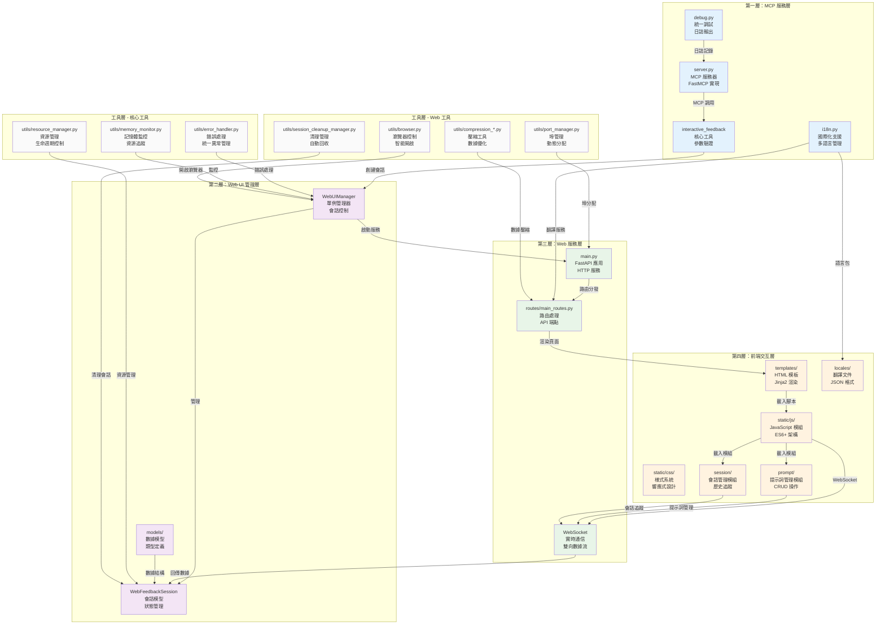

## 🔧 第一層：MCP 服務層

### server.py - MCP 服務器核心

**架構實現**：
```python
# 基於 FastMCP 的服務器實現
mcp = FastMCP("mcp-feedback-enhanced")

@mcp.tool()
async def interactive_feedback(
    project_directory: Annotated[str, Field(description="專案目錄路徑")] = ".",
    summary: Annotated[str, Field(description="AI 工作完成的摘要說明")] = "我已完成了您請求的任務。",
    timeout: Annotated[int, Field(description="等待用戶回饋的超時時間（秒）")] = 600,
) -> list:
    """
    收集用戶的互動回饋，支援文字和圖片
    """
    # 1. 參數驗證和環境檢測
    # 2. 啟動 Web UI 管理器
    # 3. 創建或更新會話
    # 4. 等待用戶回饋
    # 5. 處理和返回結果
```

**主要職責**：
- **MCP 協議實現**: 基於 FastMCP 框架的標準實現
- **工具註冊**: 註冊 `interactive_feedback` 和 `get_system_info` 工具
- **環境檢測**: 自動識別 Local/SSH Remote/WSL 環境
- **生命週期管理**: 控制 Web UI 的啟動、運行和清理
- **接口層**: 作為 AI 助手與系統的主要通信接口

**核心特性**：
- 支援 MCP 2.0+ 協議標準
- 異步處理提升性能
- 完整的錯誤處理和日誌記錄
- 參數類型驗證和文檔生成

### interactive_feedback 工具

**工具執行流程**：
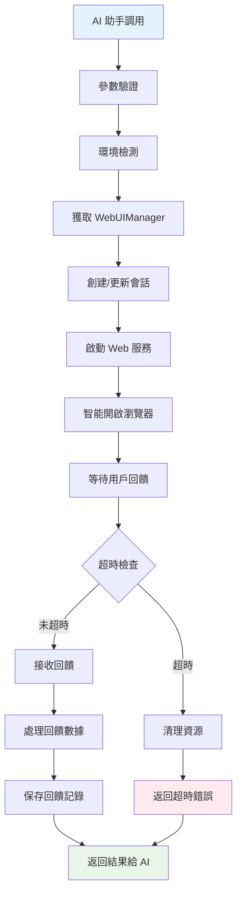

**參數說明**：
- `project_directory`: 專案目錄路徑，用於命令執行上下文
- `summary`: AI 工作摘要，顯示給用戶確認
- `timeout`: 等待超時時間，預設 600 秒（10 分鐘）

**返回格式**：
```python
# 成功返回
[
    TextContent(type="text", text="用戶回饋內容"),
    MCPImage(data="base64_encoded_image", mimeType="image/png")  # 可選
]

# 錯誤返回
[TextContent(type="text", text="錯誤描述")]
```

### i18n.py - 國際化支援

**多語言架構**：
```python
class I18nManager:
    def __init__(self):
        self._supported_languages = ["zh-TW", "en", "zh-CN"]
        self._fallback_language = "en"
        self._locales_dir = Path(__file__).parent / "web" / "locales"

    def t(self, key: str, **kwargs) -> str:
        """翻譯函數，支援巢狀鍵值和參數替換"""
```

**核心功能**：
- **三語支援**: 繁體中文、簡體中文、英文
- **智能檢測**: 基於系統語言自動選擇
- **動態切換**: 運行時語言切換無需重啟
- **巢狀翻譯**: 支援 `buttons.submit` 格式的鍵值
- **參數替換**: 支援 `{name}` 格式的動態內容
- **回退機制**: 翻譯缺失時自動使用英文

**翻譯文件結構**：
```json
{
    "app": {
        "title": "MCP Feedback Enhanced",
        "subtitle": "AI 輔助開發回饋收集器"
    },
    "buttons": {
        "submit": "提交回饋",
        "cancel": "取消"
    }
}
```

### debug.py - 統一調試系統

**調試功能**：
- **條件輸出**: 只在 `MCP_DEBUG=true` 時輸出
- **分類日誌**: 不同模組使用不同前綴
- **安全輸出**: 輸出到 stderr 避免干擾 MCP 通信
- **編碼處理**: 自動處理中文字符編碼問題

**使用方式**：
```python
from .debug import server_debug_log as debug_log
debug_log("伺服器啟動完成")  # [SERVER] 伺服器啟動完成
```

## 🎛️ 第二層：Web UI 管理層

### WebUIManager - 核心管理器

**單例模式實現**：
```python
class WebUIManager:
    _instance: Optional['WebUIManager'] = None
    _lock = threading.Lock()

    def __new__(cls, *args, **kwargs):
        if cls._instance is None:
            with cls._lock:
                if cls._instance is None:
                    cls._instance = super().__new__(cls)
        return cls._instance

    def __init__(self, host: str = "127.0.0.1", port: int = 0):
        self.current_session: Optional[WebFeedbackSession] = None
        self.global_active_tabs: Dict[str, dict] = {}
        self.app: Optional[FastAPI] = None
        self.server_thread: Optional[threading.Thread] = None
        self.port_manager = PortManager()
```

**核心職責**：
- **會話管理**: 單一活躍會話的創建、更新、清理
- **服務器控制**: FastAPI 應用的啟動、停止、重啟
- **瀏覽器控制**: 智能開啟瀏覽器，避免重複視窗
- **資源管理**: 自動清理過期資源和錯誤處理
- **狀態同步**: 維護全局狀態和標籤頁追蹤

**關鍵方法**：
```python
async def create_session(self, project_dir: str, summary: str) -> str:
    """創建新會話或更新現有會話"""

async def smart_open_browser(self, url: str) -> bool:
    """智能開啟瀏覽器，檢測活躍標籤頁"""

def cleanup_session(self, reason: CleanupReason = CleanupReason.MANUAL):
    """清理會話資源"""

def get_server_url(self) -> str:
    """獲取服務器 URL"""
```

**智能瀏覽器開啟機制**：
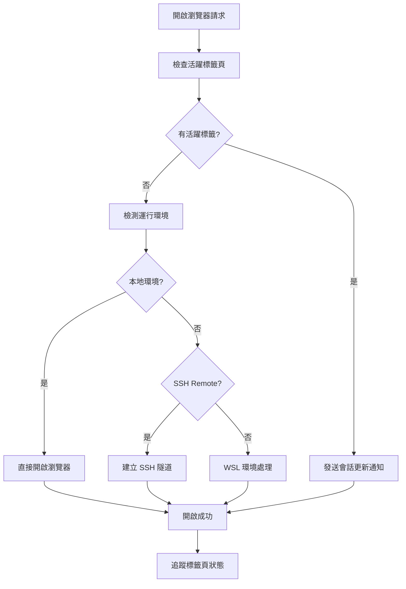

### WebFeedbackSession - 會話模型

**會話狀態機**：
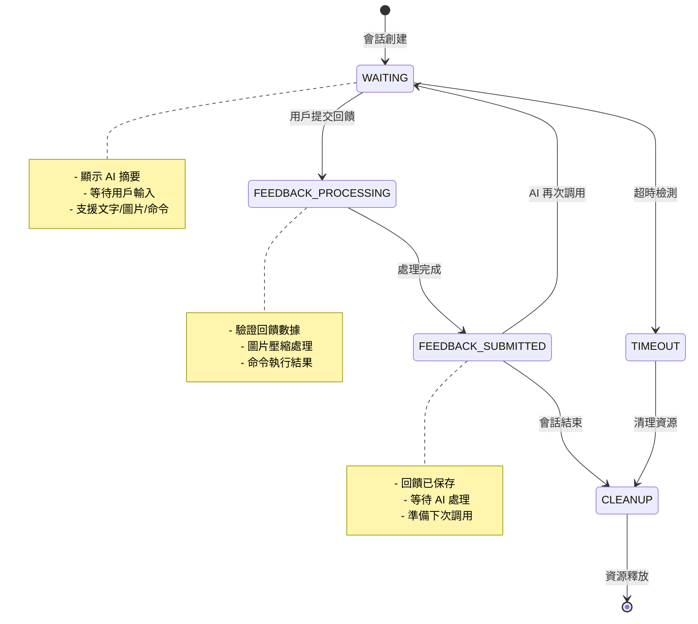

**會話數據結構**：
```python
@dataclass
class WebFeedbackSession:
    session_id: str
    project_directory: str
    summary: str
    status: SessionStatus
    created_at: datetime
    timeout: int
    feedback_future: Optional[asyncio.Future] = None

    # 回饋數據
    interactive_feedback: str = ""
    command_logs: str = ""
    images: List[Dict[str, Any]] = field(default_factory=list)

    async def wait_for_feedback(self, timeout: int) -> Dict[str, Any]:
        """等待用戶回饋，支援超時處理"""

    def update_session(self, project_dir: str, summary: str, timeout: int):
        """更新會話內容，支援 AI 多次調用"""
```

**狀態枚舉**：
```python
class SessionStatus(Enum):
    WAITING = "waiting"                    # 等待用戶回饋
    FEEDBACK_PROCESSING = "processing"     # 處理回饋中
    FEEDBACK_SUBMITTED = "submitted"       # 回饋已提交
    TIMEOUT = "timeout"                    # 會話超時
    ERROR = "error"                        # 發生錯誤
```

### models/ - 數據模型層

**FeedbackResult 模型**：
```python
@dataclass
class FeedbackResult:
    interactive_feedback: str = ""
    command_logs: str = ""
    images: List[Dict[str, Any]] = field(default_factory=list)
    session_id: str = ""
    timestamp: datetime = field(default_factory=datetime.now)

    def to_mcp_response(self) -> List[Union[TextContent, MCPImage]]:
        """轉換為 MCP 協議格式"""
```

**CleanupReason 枚舉**：
```python
class CleanupReason(Enum):
    TIMEOUT = "timeout"        # 超時清理
    MANUAL = "manual"          # 手動清理
    ERROR = "error"            # 錯誤清理
    SHUTDOWN = "shutdown"      # 系統關閉
```

**WebSocket 消息模型**：
```python
@dataclass
class WebSocketMessage:
    type: str                  # 消息類型
    data: Dict[str, Any]       # 消息數據
    session_id: Optional[str] = None
    timestamp: datetime = field(default_factory=datetime.now)
```

## 🌐 第三層：Web 服務層

### main.py - FastAPI 應用

**應用架構**：
```python
def create_app(manager: 'WebUIManager') -> FastAPI:
    """創建 FastAPI 應用實例"""
    app = FastAPI(
        title="MCP Feedback Enhanced",
        description="AI 輔助開發回饋收集系統",
        version="2.3.0"
    )

    # 設置中間件
    setup_middleware(app)

    # 設置路由
    setup_routes(manager)

    # 設置 WebSocket
    setup_websocket(app, manager)

    return app
```

**中間件配置**：
```python
def setup_middleware(app: FastAPI):
    # CORS 設定 - 允許本地開發
    app.add_middleware(
        CORSMiddleware,
        allow_origins=["http://127.0.0.1:*", "http://localhost:*"],
        allow_credentials=True,
        allow_methods=["*"],
        allow_headers=["*"],
    )

    # 靜態文件服務
    app.mount("/static", StaticFiles(directory="static"), name="static")

    # 錯誤處理中間件
    @app.exception_handler(Exception)
    async def global_exception_handler(request, exc):
        return JSONResponse(
            status_code=500,
            content={"detail": f"內部服務器錯誤: {str(exc)}"}
        )
```

**核心功能**：
- **HTTP 路由處理**: RESTful API 端點
- **WebSocket 連接管理**: 實時雙向通信
- **靜態資源服務**: CSS、JS、圖片等資源
- **模板渲染**: Jinja2 模板引擎
- **錯誤處理**: 統一的異常處理機制
- **安全配置**: CORS 和安全標頭設定

### routes/main_routes.py - 路由處理

**路由架構圖**：
```mermaid
graph TB
    subgraph "HTTP 路由"
        ROOT[GET /<br/>主頁重定向]
        FEEDBACK[GET /feedback<br/>回饋頁面]
        API_SESSION[GET /api/session<br/>會話資訊]
        API_SETTINGS[GET/POST /api/settings<br/>設定管理]
        API_I18N[GET /api/i18n<br/>翻譯資源]
        STATIC[/static/*<br/>靜態資源]
    end

    subgraph "WebSocket 路由"
        WS[/ws<br/>WebSocket 連接]
        MSG_HANDLER[訊息處理器]
        BROADCAST[廣播機制]
    end

    subgraph "API 端點"
        SUBMIT[POST /api/submit-feedback<br/>提交回饋]
        COMMAND[POST /api/execute-command<br/>執行命令]
        UPLOAD[POST /api/upload-image<br/>圖片上傳]
        STATUS[GET /api/status<br/>系統狀態]
    end

    ROOT --> FEEDBACK
    FEEDBACK --> API_SESSION
    WS --> MSG_HANDLER
    MSG_HANDLER --> BROADCAST
    SUBMIT --> MSG_HANDLER
    COMMAND --> MSG_HANDLER
    UPLOAD --> MSG_HANDLER
```

**主要路由端點**：

**頁面路由**：
```python
@app.get("/")
async def root():
    """主頁重定向到回饋頁面"""
    return RedirectResponse(url="/feedback")

@app.get("/feedback")
async def feedback_page(request: Request):
    """回饋收集頁面"""
    return templates.TemplateResponse("feedback.html", {
        "request": request,
        "project_directory": session.project_directory,
        "layout_mode": load_user_layout_settings()
    })
```

**API 路由**：
```python
@app.get("/api/session")
async def get_session():
    """獲取當前會話資訊"""

@app.post("/api/submit-feedback")
async def submit_feedback(feedback_data: dict):
    """提交用戶回饋"""

@app.post("/api/execute-command")
async def execute_command(command_data: dict):
    """執行用戶命令"""

@app.post("/api/upload-image")
async def upload_image(file: UploadFile):
    """處理圖片上傳"""
```

**WebSocket 訊息類型**：
- `connection_established`: 連接建立確認
- `session_updated`: 會話內容更新
- `submit_feedback`: 提交回饋數據
- `feedback_received`: 回饋接收確認
- `status_update`: 系統狀態更新
- `error_occurred`: 錯誤通知
- `command_result`: 命令執行結果
- `image_uploaded`: 圖片上傳完成

**WebSocket 連接管理**：
```python
@app.websocket("/ws")
async def websocket_endpoint(websocket: WebSocket):
    await websocket.accept()
    try:
        while True:
            data = await websocket.receive_json()
            await handle_websocket_message(websocket, data)
    except WebSocketDisconnect:
        await handle_disconnect(websocket)
```

## 🎨 第四層：前端交互層

### 新功能模組架構

#### 提示詞管理模組群組 (prompt/)

**模組結構**：
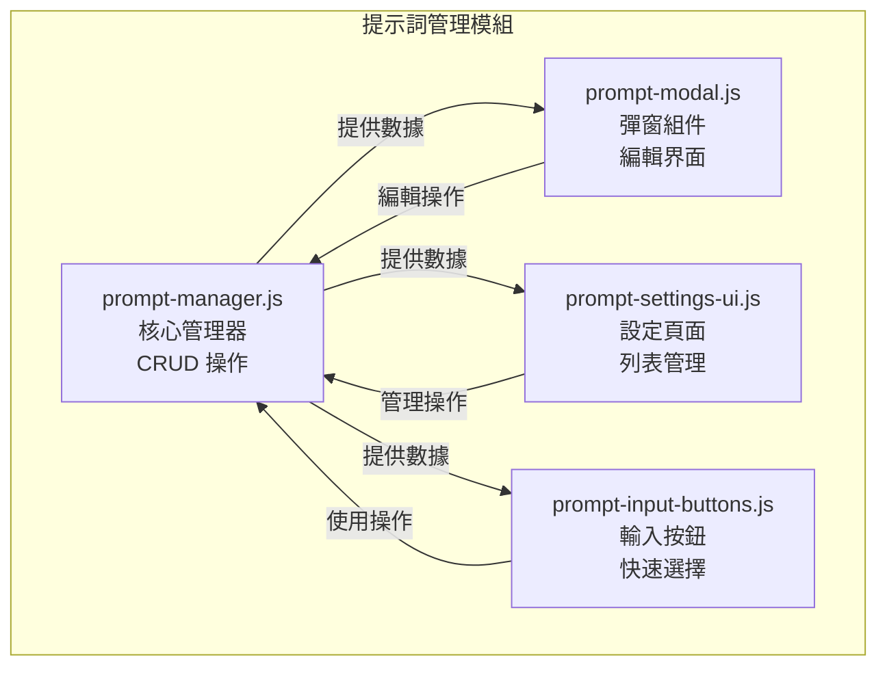

**核心功能**：
- **PromptManager**: 提示詞的增刪改查、排序、自動提交標記
- **PromptModal**: 新增/編輯提示詞的彈窗界面
- **PromptSettingsUI**: 設定頁籤中的提示詞管理界面
- **PromptInputButtons**: 回饋輸入區的快速選擇按鈕

#### 會話管理模組群組 (session/) - v2.4.3 重構增強

**模組結構**：
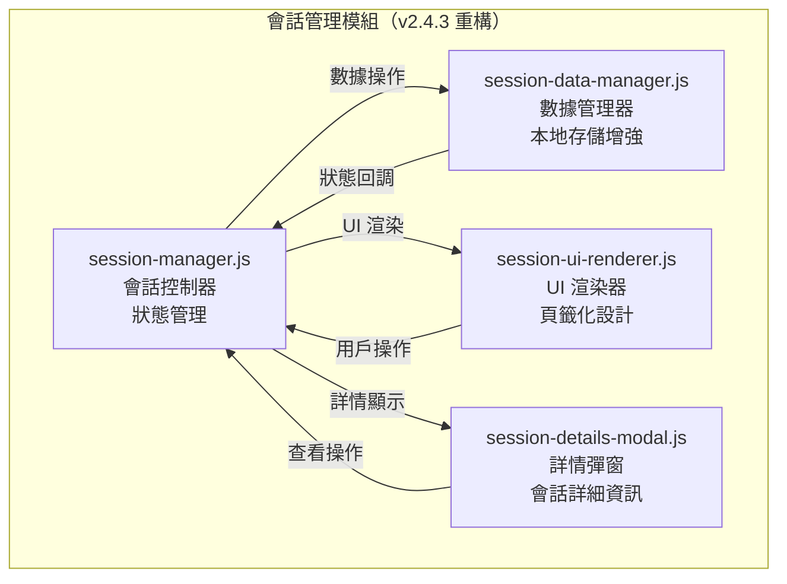

**v2.4.3 重構亮點**：
- **從側邊欄遷移到頁籤**: 解決瀏覽器相容性問題
- **本地歷史存儲**: 支援 72 小時可配置保存期限
- **隱私控制**: 三級用戶訊息記錄設定（完整/基本/停用）
- **數據管理**: 匯出和清理功能
- **UI 重新設計**: 專門的渲染器和詳情彈窗

**核心功能**：
- **SessionManager**: 當前會話的狀態管理和控制
- **SessionDataManager**: 會話歷史記錄、統計數據和本地存儲管理
- **SessionUIRenderer**: 專門的 UI 渲染器，負責會話列表和狀態顯示
- **SessionDetailsModal**: 會話詳情彈窗，提供完整的會話資訊查看

#### 音效通知模組群組 (audio/) - v2.4.3 新增

**模組結構**：
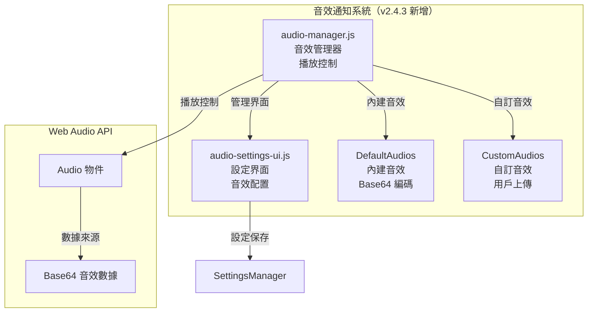

**核心功能**：
- **AudioManager**: 音效播放控制、音量管理、音效選擇
- **AudioSettingsUI**: 音效設定界面、上傳管理、測試播放
- **內建音效**: 經典提示音、通知鈴聲、輕柔鐘聲
- **自訂音效**: 支援 MP3、WAV、OGG 格式上傳和管理

**技術特性**：
- **Web Audio API**: 使用原生 Audio 物件進行播放
- **Base64 存儲**: 音效文件以 Base64 格式存儲在 localStorage
- **音量控制**: 0-100% 可調節音量
- **瀏覽器相容性**: 處理自動播放政策限制

#### 智能記憶功能 - v2.4.3 新增

**輸入框高度管理**：
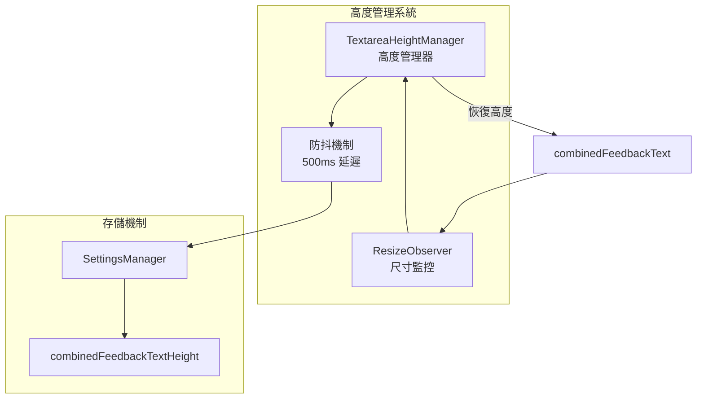

**一鍵複製功能**：
- **專案路徑複製**: 點擊路徑文字即可複製到剪貼簿
- **會話ID複製**: 點擊會話ID即可複製
- **複製反饋**: 視覺提示複製成功狀態
- **國際化支援**: 複製提示支援多語言

#### 自動提交功能整合

**整合架構**：
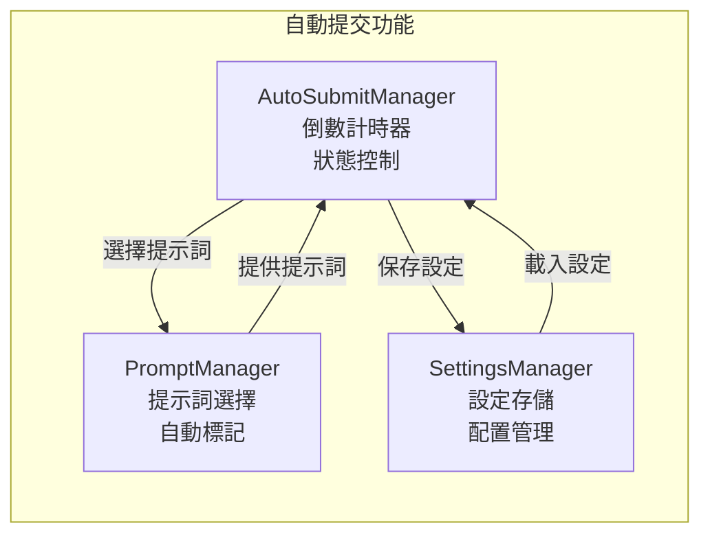

### templates/ - HTML 模板系統

**模板結構**：
```html
<!-- feedback.html - 主回饋頁面 -->
<!DOCTYPE html>
<html lang="{{ current_language }}" id="html-root">
<head>
    <meta charset="UTF-8">
    <meta name="viewport" content="width=device-width, initial-scale=1.0">
    <title>{{ title }}</title>
    <link rel="stylesheet" href="/static/css/styles.css">
</head>
<body class="layout-{{ layout_mode }}">
    <div class="container">
        <!-- 頁面頭部 -->
        <header class="header">
            <div class="header-content">
                <h1 class="title" data-i18n="app.title">MCP Feedback Enhanced</h1>
                <div class="project-info">
                    <span data-i18n="app.projectDirectory">專案目錄</span>: {{ project_directory }}
                </div>
            </div>
        </header>

        <!-- 主要內容區域 -->
        <main class="main-content">
            <!-- 標籤頁導航 -->
            <div class="tab-container">
                <div class="tab-buttons">
                    <button class="tab-button active" data-tab="combined" data-i18n="tabs.combined">📝 工作區</button>
                    <button class="tab-button" data-tab="settings" data-i18n="tabs.settings">⚙️ 設定</button>
                    <button class="tab-button" data-tab="about" data-i18n="tabs.about">ℹ️ 關於</button>
                </div>
            </div>

            <!-- 標籤頁內容 -->
            <div class="tab-content active" id="combined-tab">
                <!-- AI 摘要區域 -->
                <section class="ai-summary-section">
                    <h2 data-i18n="tabs.summary">📋 AI 摘要</h2>
                    <div id="ai-summary" class="ai-summary-content"></div>
                </section>

                <!-- 回饋表單區域 -->
                <section class="feedback-section">
                    <h2 data-i18n="tabs.feedback">💬 回饋</h2>
                    <form id="feedback-form">
                        <textarea id="feedback-text" placeholder="請輸入您的回饋..."></textarea>
                        <div class="form-actions">
                            <button type="submit" data-i18n="buttons.submit">提交回饋</button>
                        </div>
                    </form>
                </section>

                <!-- 圖片上傳區域 -->
                <section class="image-upload-section">
                    <h2 data-i18n="images.title">🖼️ 圖片上傳</h2>
                    <div id="image-upload-area" class="upload-area">
                        <input type="file" id="image-input" multiple accept="image/*">
                        <div class="upload-prompt" data-i18n="images.dragDrop">拖拽圖片到此處或點擊選擇</div>
                    </div>
                    <div id="image-preview" class="image-preview"></div>
                </section>

                <!-- 命令執行區域 -->
                <section class="command-section">
                    <h2 data-i18n="tabs.commands">⚡ 命令</h2>
                    <div class="command-input-group">
                        <input type="text" id="command-input" placeholder="輸入要執行的命令...">
                        <button id="execute-command" data-i18n="commands.execute">執行</button>
                    </div>
                    <div id="command-output" class="command-output"></div>
                </section>
            </div>
        </main>

        <!-- 狀態指示器 -->
        <footer class="footer">
            <div class="status-indicators">
                <div id="connection-status" class="connection-indicator">
                    <span data-i18n="status.connecting">連接中...</span>
                </div>
                <div id="session-status" class="session-indicator">
                    <span data-i18n="status.waiting">等待中...</span>
                </div>
            </div>
        </footer>
    </div>

    <!-- JavaScript 模組載入 -->
    <script src="/static/js/i18n.js"></script>
    <script src="/static/js/modules/utils.js"></script>
    <script src="/static/js/modules/tab-manager.js"></script>
    <script src="/static/js/modules/websocket-manager.js"></script>
    <script src="/static/js/modules/image-handler.js"></script>
    <script src="/static/js/modules/settings-manager.js"></script>
    <script src="/static/js/modules/ui-manager.js"></script>
    <script src="/static/js/modules/auto-refresh-manager.js"></script>
    <script src="/static/js/app.js"></script>
</body>
</html>
```

**模板特性**：
- **Jinja2 模板引擎**: 支援變數替換和條件渲染
- **響應式設計**: 適配桌面和移動設備
- **國際化支援**: `data-i18n` 屬性自動翻譯
- **模組化載入**: JavaScript 模組按需載入
- **無障礙設計**: 支援鍵盤導航和螢幕閱讀器

### static/js/ - JavaScript 模組系統

**模組化架構**：
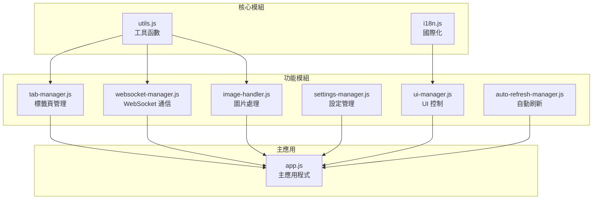

**主要模組說明**：

**app.js - 主應用程式**：
```javascript
class FeedbackApp {
    constructor(sessionId) {
        this.sessionId = sessionId;
        this.currentSessionId = null;

        // 模組管理器
        this.tabManager = null;
        this.webSocketManager = null;
        this.imageHandler = null;
        this.settingsManager = null;
        this.uiManager = null;
        this.autoRefreshManager = null;

        this.isInitialized = false;
    }

    async init() {
        // 等待國際化系統
        await this.waitForI18n();

        // 初始化管理器
        await this.initializeManagers();

        // 設置事件監聽器
        await this.setupEventListeners();

        // 設置清理處理器
        await this.setupCleanupHandlers();

        this.isInitialized = true;
    }
}
```

**websocket-manager.js - WebSocket 通信**：
```javascript
class WebSocketManager {
    constructor(app) {
        this.app = app;
        this.websocket = null;
        this.reconnectAttempts = 0;
        this.maxReconnectAttempts = 5;
        this.reconnectDelay = 1000;
    }

    async connect() {
        const protocol = window.location.protocol === 'https:' ? 'wss:' : 'ws:';
        const wsUrl = `${protocol}//${window.location.host}/ws`;

        this.websocket = new WebSocket(wsUrl);
        this.setupEventHandlers();
    }

    async sendMessage(type, data) {
        if (this.websocket?.readyState === WebSocket.OPEN) {
            this.websocket.send(JSON.stringify({ type, data }));
        }
    }
}
```

**image-handler.js - 圖片處理**：
```javascript
class ImageHandler {
    constructor(app) {
        this.app = app;
        this.maxFileSize = 1024 * 1024; // 1MB
        this.supportedFormats = ['image/png', 'image/jpeg', 'image/gif', 'image/webp'];
    }

    async handleImageUpload(files) {
        for (const file of files) {
            if (this.validateImage(file)) {
                const compressedImage = await this.compressImage(file);
                await this.uploadImage(compressedImage);
            }
        }
    }

    async compressImage(file) {
        // 圖片壓縮邏輯
        return new Promise((resolve) => {
            const canvas = document.createElement('canvas');
            const ctx = canvas.getContext('2d');
            const img = new Image();

            img.onload = () => {
                // 壓縮處理
                resolve(canvas.toBlob());
            };

            img.src = URL.createObjectURL(file);
        });
    }
}
```

**前端特性總結**：
- **模組化設計**: 清晰的職責分離和依賴管理
- **響應式 UI**: 適配不同螢幕尺寸和設備
- **實時通信**: WebSocket 雙向數據同步
- **圖片處理**: 自動壓縮和格式轉換
- **國際化**: 動態語言切換和本地化
- **錯誤處理**: 優雅的錯誤恢復機制
- **性能優化**: 延遲載入和資源快取
- **無障礙支援**: 鍵盤導航和螢幕閱讀器支援

### static/css/ - 樣式系統（v2.4.3 擴展）

**樣式文件結構**：
```
static/css/
├── styles.css                  # 主樣式文件
├── prompt-management.css       # 提示詞管理樣式
├── session-management.css      # 會話管理樣式
└── audio-management.css        # 音效管理樣式（v2.4.3 新增）
```

**v2.4.3 新增樣式特性**：

**audio-management.css - 音效管理樣式**：
```css
/* 音效管理區塊樣式 */
.audio-management-section {
    background: var(--bg-tertiary);
    border: 1px solid var(--border-color);
    border-radius: 12px;
    padding: 20px;
    margin-bottom: 20px;
    transition: all 0.3s ease;
}

/* 音效設定控制項 */
.audio-setting-item {
    display: flex;
    justify-content: space-between;
    align-items: center;
    margin-bottom: 16px;
    padding: 12px 0;
    border-bottom: 1px solid var(--border-color);
}

/* 音量控制滑桿 */
.audio-volume-slider {
    width: 120px;
    height: 6px;
    background: var(--bg-secondary);
    border-radius: 3px;
    outline: none;
}

/* 自訂音效列表 */
.audio-custom-item {
    display: flex;
    justify-content: space-between;
    align-items: center;
    padding: 12px;
    background: var(--bg-primary);
    border: 1px solid var(--border-color);
    border-radius: 8px;
    margin-bottom: 8px;
}
```

**session-management.css - 會話管理樣式增強**：
```css
/* v2.4.3 頁籤化設計 */
.session-tab-content {
    padding: 20px;
    background: var(--bg-primary);
    border-radius: 8px;
    margin-top: 16px;
}

/* 會話卡片樣式 */
.session-card {
    background: var(--bg-secondary);
    border: 1px solid var(--border-color);
    border-radius: 8px;
    padding: 16px;
    margin-bottom: 12px;
    transition: all 0.3s ease;
}

.session-card:hover {
    border-color: var(--accent-color);
    box-shadow: 0 2px 8px rgba(0, 122, 204, 0.1);
}

/* 一鍵複製按鈕樣式 */
.copy-button {
    background: transparent;
    border: none;
    color: var(--accent-color);
    cursor: pointer;
    padding: 2px 6px;
    border-radius: 4px;
    transition: background-color 0.2s ease;
}

.copy-button:hover {
    background: var(--bg-tertiary);
}
```

**響應式設計增強**：
- **移動設備優化**: 音效控制項在小螢幕下垂直排列
- **觸控友好**: 按鈕和滑桿適配觸控操作
- **視覺反饋**: 懸停和點擊狀態的視覺提示
- **深色主題**: 完整的深色主題支援

## 🛠️ 工具層組件

### utils/error_handler.py - 錯誤處理框架

**統一錯誤處理**：
```python
class ErrorHandler:
    @staticmethod
    def handle_error(error_type: ErrorType, error: Exception, context: str = "") -> dict:
        """統一錯誤處理入口"""
        error_info = {
            "type": error_type.value,
            "message": str(error),
            "context": context,
            "timestamp": datetime.now().isoformat(),
            "suggestions": ErrorHandler._get_suggestions(error_type)
        }

        # 記錄錯誤日誌
        debug_log(f"錯誤處理: {error_info}")

        return error_info

class ErrorType(Enum):
    NETWORK_ERROR = "network_error"
    VALIDATION_ERROR = "validation_error"
    TIMEOUT_ERROR = "timeout_error"
    SYSTEM_ERROR = "system_error"
    USER_ERROR = "user_error"
```

### utils/memory_monitor.py - 記憶體監控

**資源監控**：
```python
class MemoryMonitor:
    def __init__(self):
        self.process = psutil.Process()
        self.baseline_memory = self.get_memory_usage()

    def get_memory_usage(self) -> dict:
        """獲取當前記憶體使用情況"""
        memory_info = self.process.memory_info()
        return {
            "rss": memory_info.rss,  # 實際記憶體使用
            "vms": memory_info.vms,  # 虛擬記憶體使用
            "percent": self.process.memory_percent(),
            "available": psutil.virtual_memory().available
        }

    def check_memory_threshold(self, threshold_mb: int = 100) -> bool:
        """檢查記憶體使用是否超過閾值"""
        current_memory = self.get_memory_usage()
        memory_mb = current_memory["rss"] / 1024 / 1024
        return memory_mb > threshold_mb
```

### utils/resource_manager.py - 資源管理

**生命週期管理**：
```python
class ResourceManager:
    def __init__(self):
        self.temp_files: List[Path] = []
        self.active_processes: List[subprocess.Popen] = []
        self.cleanup_callbacks: List[Callable] = []

    def register_temp_file(self, file_path: Path):
        """註冊臨時文件以便清理"""
        self.temp_files.append(file_path)

    def register_process(self, process: subprocess.Popen):
        """註冊進程以便清理"""
        self.active_processes.append(process)

    def cleanup_all(self):
        """清理所有註冊的資源"""
        # 清理臨時文件
        for file_path in self.temp_files:
            try:
                if file_path.exists():
                    file_path.unlink()
            except Exception as e:
                debug_log(f"清理臨時文件失敗: {e}")

        # 終止進程
        for process in self.active_processes:
            try:
                process.terminate()
                process.wait(timeout=5)
            except Exception as e:
                debug_log(f"終止進程失敗: {e}")
```

### utils/browser.py - 瀏覽器控制

**智能瀏覽器開啟**：
```python
class BrowserOpener:
    @staticmethod
    def open_browser(url: str) -> bool:
        """智能開啟瀏覽器，支援多種環境"""
        try:
            # 檢測運行環境
            environment = detect_environment()

            if environment == "local":
                return BrowserOpener._open_local(url)
            elif environment == "ssh":
                return BrowserOpener._open_ssh(url)
            elif environment == "wsl":
                return BrowserOpener._open_wsl(url)
            else:
                return BrowserOpener._open_fallback(url)

        except Exception as e:
            debug_log(f"開啟瀏覽器失敗: {e}")
            return False

    @staticmethod
    def _open_local(url: str) -> bool:
        """本地環境開啟瀏覽器"""
        webbrowser.open(url)
        return True

    @staticmethod
    def _open_ssh(url: str) -> bool:
        """SSH 環境處理"""
        # 提供 SSH 隧道建立指引
        print(f"請在本地終端執行: ssh -L 8765:127.0.0.1:8765 user@host")
        print(f"然後在本地瀏覽器開啟: {url}")
        return True

    @staticmethod
    def _open_wsl(url: str) -> bool:
        """WSL 環境處理"""
        try:
            subprocess.run(["cmd.exe", "/c", "start", url], check=True)
            return True
        except Exception:
            return BrowserOpener._open_fallback(url)
```

### utils/port_manager.py - 埠管理

**動態埠分配**：
```python
class PortManager:
    def __init__(self, start_port: int = 8765, end_port: int = 8865):
        self.start_port = start_port
        self.end_port = end_port
        self.allocated_ports: Set[int] = set()

    def find_available_port(self) -> int:
        """尋找可用埠"""
        for port in range(self.start_port, self.end_port + 1):
            if self.is_port_available(port):
                self.allocated_ports.add(port)
                return port
        raise RuntimeError("無可用埠")

    def is_port_available(self, port: int) -> bool:
        """檢查埠是否可用"""
        try:
            with socket.socket(socket.AF_INET, socket.SOCK_STREAM) as sock:
                sock.bind(('127.0.0.1', port))
                return True
        except OSError:
            return False

    def release_port(self, port: int):
        """釋放埠"""
        self.allocated_ports.discard(port)
```

### utils/session_cleanup_manager.py - 會話清理

**自動清理機制**：
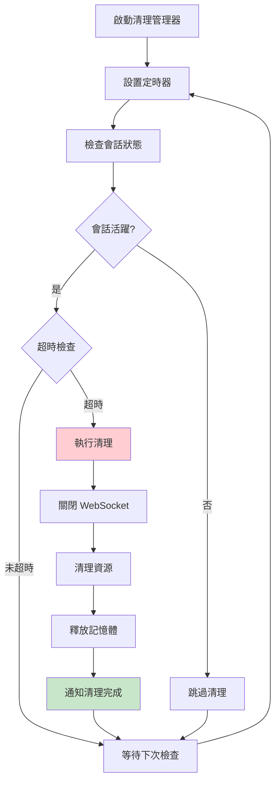

**清理策略**：
- **定時檢查**: 每 30 秒檢查一次會話狀態
- **超時清理**: 會話超時自動觸發清理
- **資源回收**: WebSocket 連接、進程、記憶體
- **優雅關閉**: 確保資源正確釋放
- **錯誤恢復**: 清理失敗時的備用方案

### utils/compression_*.py - 壓縮工具

**數據壓縮優化**：
- **圖片壓縮**: 自動壓縮上傳圖片至 1MB 以下
- **JSON 壓縮**: 大型 JSON 數據的 gzip 壓縮
- **傳輸優化**: WebSocket 消息的選擇性壓縮
- **快取機制**: 壓縮結果快取避免重複處理

## 🧪 測試架構

### 測試組織結構

```
tests/
├── unit/                    # 單元測試
│   ├── test_error_handler.py
│   ├── test_memory_monitor.py
│   ├── test_port_manager.py
│   └── test_web_ui.py
├── integration/             # 集成測試
│   ├── test_mcp_workflow.py
│   ├── test_web_integration.py
│   └── test_i18n_integration.py
├── helpers/                 # 測試輔助工具
│   ├── mcp_client.py
│   └── test_utils.py
├── fixtures/                # 測試數據
│   └── test_data.py
└── conftest.py             # pytest 配置
```

### 測試策略

**單元測試**：
- 每個工具模組的獨立測試
- 數據模型的驗證測試
- 錯誤處理機制測試
- 國際化功能測試

**集成測試**：
- MCP 工具完整工作流程
- Web UI 與後端交互
- WebSocket 通信測試
- 多語言切換測試

**性能測試**：
- 記憶體使用監控
- 會話處理性能
- 並發連接測試
- 資源清理效率

## 🔧 開發工具鏈

### 代碼品質工具

**Ruff (Linting + Formatting)**：
- 代碼風格檢查和自動修復
- 安全漏洞檢測
- 導入排序和優化
- 複雜度控制

**mypy (類型檢查)**：
- 靜態類型檢查
- 漸進式類型註解
- 第三方庫類型支援
- 錯誤預防

**pre-commit (提交檢查)**：
- 提交前自動檢查
- 代碼格式化
- 測試執行
- 文檔更新

### 依賴管理

**uv (現代 Python 包管理)**：
- 快速依賴解析
- 鎖定文件管理
- 開發環境隔離
- 跨平台支援

---

## 📚 相關文檔

- **[系統架構總覽](./system-overview.md)** - 了解整體架構設計理念
- **[交互流程文檔](./interaction-flows.md)** - 詳細的用戶交互和系統流程
- **[API 參考文檔](./api-reference.md)** - 完整的 API 端點和參數說明
- **[部署指南](./deployment-guide.md)** - 環境配置和部署最佳實踐

---

**版本**: 2.4.3
**最後更新**: 2025年6月14日
**維護者**: Minidoracat
**架構類型**: Web-Only 四層架構
**v2.4.3 新功能**: 音效通知系統、會話管理重構、智能記憶功能
**技術棧**: Python 3.11+, FastAPI, FastMCP, WebSocket, Web Audio API
