# 部署指南

## 🚀 部署架構概覽

MCP Feedback Enhanced 支援多種部署環境，具備智能環境檢測和自適應配置能力。

### 部署拓撲圖

```mermaid
graph TB
    subgraph "本地開發環境"
        LOCAL[本地機器]
        LOCAL_BROWSER[本地瀏覽器]
        LOCAL --> LOCAL_BROWSER
    end

    subgraph "SSH 遠程環境"
        REMOTE[遠程服務器]
        SSH_TUNNEL[SSH 隧道]
        LOCAL_CLIENT[本地客戶端]
        REMOTE --> SSH_TUNNEL
        SSH_TUNNEL --> LOCAL_CLIENT
    end

    subgraph "WSL 環境"
        WSL[WSL 子系統]
        WIN_BROWSER[Windows 瀏覽器]
        WSL --> WIN_BROWSER
    end

    subgraph "容器化部署"
        DOCKER[Docker 容器]
        PORT_MAP[埠映射]
        HOST[宿主機]
        DOCKER --> PORT_MAP
        PORT_MAP --> HOST
    end
```



## 🛠️ 安裝和配置

### 系統要求

#### 最低要求
- **Python**: 3.11 或更高版本
- **內存**: 512MB 可用內存
- **磁盤**: 100MB 可用空間
- **網路**: 可訪問的網路連接
- **瀏覽器**: 支援 Web Audio API 的現代瀏覽器（v2.4.3 音效功能）

#### 推薦配置
- **Python**: 3.12+
- **內存**: 1GB+ 可用內存
- **磁盤**: 500MB+ 可用空間（包含音效文件存儲）
- **CPU**: 2 核心或更多
- **瀏覽器**: Chrome 90+, Firefox 88+, Safari 14+（完整功能支援）

### 安裝方式

#### 1. 使用 uvx（推薦）
```bash
# 直接運行
uvx mcp-feedback-enhanced@latest web

# 指定版本
uvx mcp-feedback-enhanced@2.4.3 web
```

#### 2. 使用 pip
```bash
# 安裝
pip install mcp-feedback-enhanced

# 運行
mcp-feedback-enhanced web
```

#### 3. 從源碼安裝
```bash
# 克隆倉庫
git clone https://github.com/Minidoracat/mcp-feedback-enhanced.git
cd mcp-feedback-enhanced

# 使用 uv 安裝
uv sync

# 運行
uv run python -m mcp_feedback_enhanced web
```

## 🌍 環境配置

### 環境檢測機制

```mermaid
flowchart TD
    START[啟動檢測] --> SSH{SSH 環境?}
    SSH -->|是| SSH_CONFIG[SSH 配置]
    SSH -->|否| WSL{WSL 環境?}
    WSL -->|是| WSL_CONFIG[WSL 配置]
    WSL -->|否| LOCAL_CONFIG[本地配置]

    SSH_CONFIG --> TUNNEL[建立 SSH 隧道]
    WSL_CONFIG --> WSL_BROWSER[WSL 瀏覽器開啟]
    LOCAL_CONFIG --> LOCAL_BROWSER[本地瀏覽器開啟]

    TUNNEL --> SUCCESS[部署成功]
    WSL_BROWSER --> SUCCESS
    LOCAL_BROWSER --> SUCCESS
```



### 1. 本地環境部署

**特點**:
- 直接在本地機器運行
- 自動開啟本地瀏覽器
- 最簡單的部署方式

**配置**:
```bash
# 運行命令
mcp-feedback-enhanced web

# 自動檢測並開啟瀏覽器
# 默認地址: http://localhost:8000
```

### 2. SSH 遠程環境部署

**特點**:
- 在遠程服務器運行服務
- 自動建立 SSH 隧道
- 本地瀏覽器訪問遠程服務

**配置步驟**:

1. **在遠程服務器安裝**:
```bash
# SSH 連接到遠程服務器
ssh user@remote-server

# 安裝服務
pip install mcp-feedback-enhanced
```

2. **運行服務**:
```bash
# 在遠程服務器運行
mcp-feedback-enhanced web --host 0.0.0.0 --port 8000
```

3. **建立 SSH 隧道**（自動或手動）:
```bash
# 手動建立隧道（如果自動檢測失敗）
ssh -L 8000:localhost:8000 user@remote-server
```

### 3. WSL 環境部署

**特點**:
- 在 WSL 子系統中運行
- 自動開啟 Windows 瀏覽器
- 跨系統無縫集成

**配置**:
```bash
# 在 WSL 中運行
mcp-feedback-enhanced web

# 自動檢測 WSL 環境並開啟 Windows 瀏覽器
```

### 4. 容器化部署

#### Docker 部署
```dockerfile
# Dockerfile
FROM python:3.12-slim

WORKDIR /app
COPY . .

RUN pip install mcp-feedback-enhanced

EXPOSE 8000

CMD ["mcp-feedback-enhanced", "web", "--host", "0.0.0.0", "--port", "8000"]
```

```bash
# 構建和運行
docker build -t mcp-feedback-enhanced .
docker run -p 8000:8000 mcp-feedback-enhanced
```

#### Docker Compose
```yaml
# docker-compose.yml
version: '3.8'

services:
  mcp-feedback:
    build: .
    ports:
      - "8000:8000"
    environment:
      - ENVIRONMENT=docker
    volumes:
      - ./projects:/app/projects
    restart: unless-stopped
```

## ⚙️ 配置選項

### 命令行參數

```bash
mcp-feedback-enhanced web [OPTIONS]
```

| 參數 | 類型 | 預設值 | 描述 |
|------|------|--------|------|
| `--host` | `str` | `localhost` | 綁定的主機地址 |
| `--port` | `int` | `8000` | 服務埠號 |
| `--debug` | `bool` | `False` | 啟用調試模式 |
| `--no-browser` | `bool` | `False` | 不自動開啟瀏覽器 |
| `--timeout` | `int` | `600` | 預設會話超時時間（秒） |
| `--audio-enabled` | `bool` | `True` | 啟用音效通知（v2.4.3 新增） |
| `--session-retention` | `int` | `72` | 會話歷史保存時間（小時，v2.4.3 新增） |

### 環境變數

```bash
# 設置環境變數
export MCP_FEEDBACK_HOST=0.0.0.0
export MCP_FEEDBACK_PORT=9000
export MCP_FEEDBACK_DEBUG=true
export MCP_FEEDBACK_TIMEOUT=1200
export MCP_FEEDBACK_AUDIO_ENABLED=true
export MCP_FEEDBACK_SESSION_RETENTION=72
```

### 配置文件
```json
// config.json
{
    "server": {
        "host": "localhost",
        "port": 8000,
        "debug": false
    },
    "session": {
        "timeout": 600,
        "max_connections": 5
    },
    "ui": {
        "default_language": "zh-TW",
        "theme": "light"
    },
    "audio": {
        "enabled": true,
        "default_volume": 75,
        "max_custom_audios": 20,
        "max_file_size_mb": 2
    },
    "session_history": {
        "retention_hours": 72,
        "max_retention_hours": 168,
        "privacy_level": "full",
        "auto_cleanup": true
    }
}
```

## 🆕 v2.4.3 版本部署考慮

### 音效通知系統部署

#### 瀏覽器相容性檢查
```javascript
// 檢查 Web Audio API 支援
function checkAudioSupport() {
    if (typeof Audio === 'undefined') {
        console.warn('Web Audio API 不支援，音效功能將被停用');
        return false;
    }
    return true;
}
```

#### 音效文件存儲配置
```json
{
    "audio_storage": {
        "type": "localStorage",
        "max_size_mb": 10,
        "compression": true,
        "fallback_enabled": true
    }
}
```

#### 自動播放政策處理
```bash
# 部署時需要考慮瀏覽器自動播放限制
# Chrome: 需要用戶交互後才能播放音效
# Firefox: 預設允許音效播放
# Safari: 需要用戶手勢觸發
```

### 會話管理重構部署

#### localStorage 容量規劃
```javascript
// 估算存儲需求
const estimatedStorage = {
    sessions_per_day: 50,
    average_session_size_kb: 5,
    retention_days: 3,
    total_size_mb: (50 * 5 * 3) / 1024  // 約 0.73 MB
};
```

#### 隱私設定配置
```json
{
    "privacy_defaults": {
        "user_message_recording": "full",
        "retention_hours": 72,
        "auto_cleanup": true,
        "export_enabled": true
    }
}
```

### 智能記憶功能部署

#### ResizeObserver 支援檢查
```javascript
// 檢查 ResizeObserver 支援
if (typeof ResizeObserver === 'undefined') {
    console.warn('ResizeObserver 不支援，高度記憶功能將使用 fallback');
    // 使用 window.resize 事件作為 fallback
}
```

#### 設定存儲優化
```json
{
    "memory_settings": {
        "debounce_delay_ms": 500,
        "max_stored_heights": 10,
        "cleanup_interval_hours": 24
    }
}
```

## 🔧 運維管理

### 服務監控

#### 健康檢查端點
```bash
# 檢查服務狀態
curl http://localhost:8000/health

# 響應示例
{
    "status": "healthy",
    "version": "2.4.3",
    "uptime": "2h 30m 15s",
    "active_sessions": 1,
    "features": {
        "audio_notifications": true,
        "session_history": true,
        "smart_memory": true
    },
    "storage": {
        "session_history_count": 25,
        "custom_audio_count": 3,
        "localStorage_usage_mb": 1.2
    }
}
```

#### 日誌監控
```python
# 日誌配置
import logging

logging.basicConfig(
    level=logging.INFO,
    format='%(asctime)s - %(name)s - %(levelname)s - %(message)s',
    handlers=[
        logging.FileHandler('mcp-feedback.log'),
        logging.StreamHandler()
    ]
)
```

### 性能調優

#### 內存優化
```python
# 會話清理配置
SESSION_CLEANUP_INTERVAL = 300  # 5分鐘
SESSION_TIMEOUT = 600  # 10分鐘
MAX_CONCURRENT_SESSIONS = 10
```

#### 網路優化
```python
# WebSocket 配置
WEBSOCKET_PING_INTERVAL = 30
WEBSOCKET_PING_TIMEOUT = 10
MAX_WEBSOCKET_CONNECTIONS = 50
```

### 故障排除

#### 常見問題

**v2.4.3 新增問題**：

1. **音效無法播放**
```bash
# 檢查瀏覽器自動播放政策
# 解決方案：用戶需要先與頁面交互
console.log('請點擊頁面任意位置以啟用音效功能');

# 檢查音效文件格式
# 支援格式：MP3, WAV, OGG
# 最大文件大小：2MB
```

2. **會話歷史丟失**
```bash
# 檢查 localStorage 容量
# 解決方案：清理過期數據或增加保存期限
localStorage.getItem('sessionHistory');

# 檢查隱私設定
# 確認用戶訊息記錄等級設定正確
```

3. **輸入框高度不記憶**
```bash
# 檢查 ResizeObserver 支援
if (typeof ResizeObserver === 'undefined') {
    console.warn('瀏覽器不支援 ResizeObserver');
}

# 檢查設定存儲
localStorage.getItem('combinedFeedbackTextHeight');
```

4. **埠被佔用**
```bash
# 檢查埠使用情況
netstat -tulpn | grep 8000

# 解決方案：使用不同埠
mcp-feedback-enhanced web --port 8001
```

2. **瀏覽器無法開啟**
```bash
# 手動開啟瀏覽器
mcp-feedback-enhanced web --no-browser
# 然後手動訪問 http://localhost:8000
```

3. **SSH 隧道失敗**
```bash
# 手動建立隧道
ssh -L 8000:localhost:8000 user@remote-server

# 或使用不同埠
ssh -L 8001:localhost:8000 user@remote-server
```

#### 調試模式
```bash
# 啟用詳細日誌
mcp-feedback-enhanced web --debug

# 查看詳細錯誤信息
export PYTHONPATH=.
python -m mcp_feedback_enhanced.debug
```

### 安全配置

#### 生產環境安全
```python
# 限制 CORS
app.add_middleware(
    CORSMiddleware,
    allow_origins=["https://yourdomain.com"],
    allow_credentials=True,
    allow_methods=["GET", "POST"],
    allow_headers=["*"],
)

# 添加安全標頭
@app.middleware("http")
async def add_security_headers(request, call_next):
    response = await call_next(request)
    response.headers["X-Content-Type-Options"] = "nosniff"
    response.headers["X-Frame-Options"] = "DENY"
    response.headers["X-XSS-Protection"] = "1; mode=block"
    return response
```

#### 防火牆配置
```bash
# Ubuntu/Debian
sudo ufw allow 8000/tcp

# CentOS/RHEL
sudo firewall-cmd --permanent --add-port=8000/tcp
sudo firewall-cmd --reload
```

## 📊 監控和指標

### 系統指標
- CPU 使用率
- 內存使用量
- 網路連接數
- 活躍會話數

### 業務指標
- 會話創建率
- 回饋提交率
- 平均回應時間
- 錯誤率

### v2.4.3 新增指標
- 音效播放成功率
- 會話歷史存儲使用量
- 自訂音效上傳數量
- 輸入框高度調整頻率
- localStorage 使用量

### 監控工具集成
```python
# Prometheus 指標
from prometheus_client import Counter, Histogram, Gauge

session_counter = Counter('mcp_sessions_total', 'Total sessions created')
response_time = Histogram('mcp_response_time_seconds', 'Response time')
active_sessions = Gauge('mcp_active_sessions', 'Active sessions')

# v2.4.3 新增指標
audio_plays = Counter('mcp_audio_plays_total', 'Total audio notifications played')
audio_errors = Counter('mcp_audio_errors_total', 'Total audio playback errors')
session_history_size = Gauge('mcp_session_history_size_bytes', 'Session history storage size')
custom_audio_count = Gauge('mcp_custom_audio_count', 'Number of custom audio files')
height_adjustments = Counter('mcp_height_adjustments_total', 'Total textarea height adjustments')
```

---

## 🔄 版本升級指南

### 從 v2.4.2 升級到 v2.4.3

#### 1. 備份現有數據
```bash
# 備份用戶設定
cp ~/.mcp-feedback/settings.json ~/.mcp-feedback/settings.json.backup

# 備份提示詞數據
cp ~/.mcp-feedback/prompts.json ~/.mcp-feedback/prompts.json.backup
```

#### 2. 升級軟體
```bash
# 使用 uvx 升級
uvx mcp-feedback-enhanced@2.4.3 web

# 或使用 pip 升級
pip install --upgrade mcp-feedback-enhanced==2.4.3
```

#### 3. 驗證新功能
```bash
# 檢查音效功能
curl http://localhost:8000/health | jq '.features.audio_notifications'

# 檢查會話歷史功能
curl http://localhost:8000/health | jq '.features.session_history'

# 檢查智能記憶功能
curl http://localhost:8000/health | jq '.features.smart_memory'
```

#### 4. 配置遷移
```json
// 新增的配置項目會自動使用預設值
{
    "audio": {
        "enabled": true,
        "volume": 75,
        "selectedAudioId": "default-beep"
    },
    "sessionHistory": {
        "retentionHours": 72,
        "privacyLevel": "full"
    },
    "smartMemory": {
        "heightMemoryEnabled": true
    }
}
```

### 回滾指南

如果需要回滾到 v2.4.2：

```bash
# 停止服務
pkill -f mcp-feedback-enhanced

# 安裝舊版本
pip install mcp-feedback-enhanced==2.4.2

# 恢復備份設定
cp ~/.mcp-feedback/settings.json.backup ~/.mcp-feedback/settings.json

# 重新啟動服務
mcp-feedback-enhanced web
```

---

**版本**: 2.4.3
**最後更新**: 2025年6月14日
**維護者**: Minidoracat
**新功能**: 音效通知系統、會話管理重構、智能記憶功能、一鍵複製
**完成**: 架構文檔體系已更新完成，包含 v2.4.3 版本的完整技術文檔和部署指南。
