# 交互流程文檔

## 🔄 AI 助手與 MCP 服務完整交互流程

本文檔詳細描述 AI 助手調用 MCP Feedback Enhanced 服務的完整流程，包括首次調用、多次循環調用、錯誤處理和性能優化機制。

### 核心設計理念

- **持久化會話**: 支援 AI 助手多次循環調用，無需重複建立連接
- **智能環境適配**: 自動檢測並適配本地、SSH Remote、WSL 環境
- **無縫狀態切換**: 會話更新時前端局部刷新，保持用戶操作狀態
- **優雅錯誤處理**: 完整的錯誤恢復機制和超時保護
- **資源優化**: 單一活躍會話模式，最小化資源佔用

## 📋 流程概覽

### 整體交互時序圖

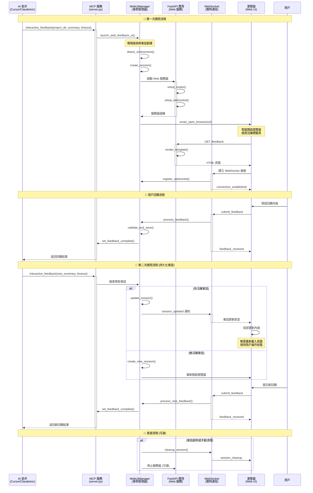

## 🚀 第一次調用詳細流程

### 1. AI 助手發起調用

**MCP 工具調用格式**：
```python
# AI 助手通過 MCP 協議調用
result = await interactive_feedback(
    project_directory="./my-project",
    summary="我已完成了功能 X 的實現，請檢查代碼品質和邏輯正確性。主要變更包括：\n1. 新增錯誤處理機制\n2. 優化性能瓶頸\n3. 增加單元測試覆蓋率",
    timeout=600  # 10 分鐘超時
)
```

**參數說明**：
- `project_directory`: 專案根目錄，用於命令執行上下文
- `summary`: AI 工作摘要，向用戶說明已完成的工作
- `timeout`: 等待用戶回饋的超時時間（秒）

### 2. MCP 服務處理流程

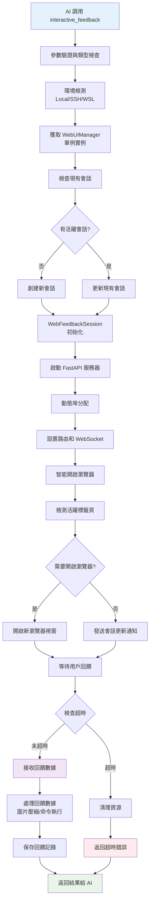

**關鍵步驟詳解**：

#### 2.1 環境檢測與適配
```python
def detect_environment() -> str:
    """智能檢測運行環境"""
    # SSH Remote 環境檢測
    if os.environ.get('SSH_CLIENT') or os.environ.get('SSH_TTY'):
        return "ssh"

    # WSL 環境檢測
    elif 'microsoft' in platform.uname().release.lower():
        return "wsl"

    # 容器環境檢測
    elif os.path.exists('/.dockerenv'):
        return "docker"

    # 本地環境
    else:
        return "local"

def get_environment_config(env_type: str) -> dict:
    """根據環境類型獲取配置"""
    configs = {
        "local": {
            "browser_command": "default",
            "host": "127.0.0.1",
            "auto_open": True
        },
        "ssh": {
            "browser_command": None,
            "host": "127.0.0.1",
            "auto_open": False,
            "tunnel_hint": "ssh -L {port}:127.0.0.1:{port} user@host"
        },
        "wsl": {
            "browser_command": "cmd.exe /c start",
            "host": "127.0.0.1",
            "auto_open": True
        }
    }
    return configs.get(env_type, configs["local"])
```

#### 2.2 智能會話管理
```python
async def create_or_update_session(
    self,
    project_dir: str,
    summary: str,
    timeout: int
) -> str:
    """創建新會話或更新現有會話"""

    # 保存現有 WebSocket 連接
    existing_websockets = []
    if self.current_session:
        existing_websockets = list(self.current_session.websockets)
        debug_log(f"保存 {len(existing_websockets)} 個現有 WebSocket 連接")

    # 創建新會話
    session_id = str(uuid.uuid4())
    self.current_session = WebFeedbackSession(
        session_id=session_id,
        project_directory=os.path.abspath(project_dir),
        summary=summary,
        timeout=timeout,
        status=SessionStatus.WAITING,
        created_at=datetime.now()
    )

    # 繼承 WebSocket 連接，實現無縫切換
    for ws in existing_websockets:
        if ws.client_state == WebSocketState.CONNECTED:
            self.current_session.add_websocket(ws)
            debug_log("WebSocket 連接已繼承到新會話")

    # 標記需要發送會話更新通知
    self._pending_session_update = True

    return session_id
```

#### 2.3 動態埠管理
```python
class PortManager:
    def find_available_port(self, preferred_port: int = 8765) -> int:
        """智能埠分配"""
        # 優先使用環境變數指定的埠
        env_port = os.environ.get('MCP_WEB_PORT')
        if env_port and env_port != "0":
            try:
                port = int(env_port)
                if self.is_port_available(port):
                    return port
            except ValueError:
                pass

        # 嘗試首選埠
        if self.is_port_available(preferred_port):
            return preferred_port

        # 動態分配埠
        for port in range(8765, 8865):
            if self.is_port_available(port):
                return port

        # 系統自動分配
        with socket.socket(socket.AF_INET, socket.SOCK_STREAM) as sock:
            sock.bind(('127.0.0.1', 0))
            return sock.getsockname()[1]
```

### 3. Web UI 連接建立與初始化

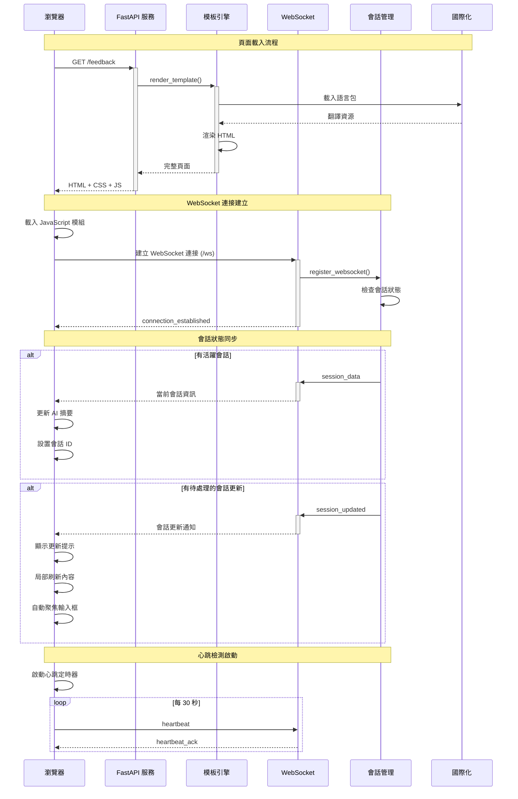

**連接建立關鍵步驟**：

#### 3.1 頁面渲染
```python
@app.get("/feedback")
async def feedback_page(request: Request):
    """回饋頁面渲染"""
    manager = get_web_ui_manager()
    session = manager.current_session

    # 載入用戶設定
    layout_mode = load_user_layout_settings()

    # 獲取當前語言
    i18n_manager = get_i18n_manager()
    current_language = i18n_manager.get_current_language()

    return templates.TemplateResponse("feedback.html", {
        "request": request,
        "project_directory": session.project_directory if session else ".",
        "layout_mode": layout_mode,
        "current_language": current_language,
        "session_id": session.session_id if session else None,
        "title": i18n_manager.t("app.title")
    })
```

#### 3.2 WebSocket 連接處理
```python
@app.websocket("/ws")
async def websocket_endpoint(websocket: WebSocket):
    """WebSocket 連接端點"""
    await websocket.accept()

    try:
        # 註冊 WebSocket 連接
        manager = get_web_ui_manager()
        if manager.current_session:
            manager.current_session.add_websocket(websocket)

        # 發送連接確認
        await websocket.send_json({
            "type": "connection_established",
            "data": {
                "timestamp": datetime.now().isoformat(),
                "session_id": manager.current_session.session_id if manager.current_session else None
            }
        })

        # 如果有待處理的會話更新，立即發送
        if manager._pending_session_update and manager.current_session:
            await websocket.send_json({
                "type": "session_updated",
                "data": {
                    "session_id": manager.current_session.session_id,
                    "summary": manager.current_session.summary,
                    "project_directory": manager.current_session.project_directory
                }
            })
            manager._pending_session_update = False

        # 處理訊息循環
        while True:
            data = await websocket.receive_json()
            await handle_websocket_message(websocket, data)

    except WebSocketDisconnect:
        # 處理連接斷開
        if manager.current_session:
            manager.current_session.remove_websocket(websocket)
        debug_log("WebSocket 連接已斷開")
```

## 🔄 多次循環調用機制

### 持久化會話架構

MCP Feedback Enhanced 的核心創新在於**持久化會話架構**，支援 AI 助手進行多次循環調用而無需重新建立連接。

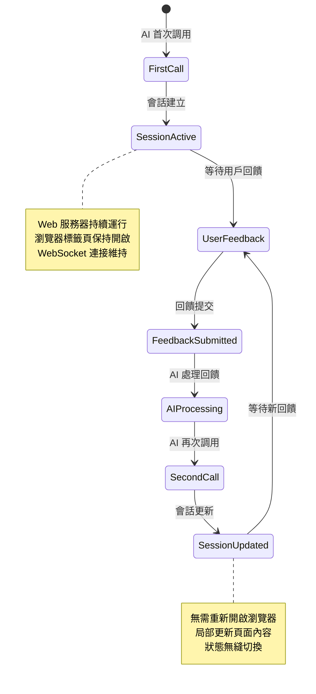

### 第二次調用流程

#### 1. AI 助手再次調用
```python
# AI 根據用戶回饋進行調整後再次調用
result = await interactive_feedback(
    project_directory="./my-project",
    summary="根據您的建議，我已修改了錯誤處理邏輯，請再次確認",
    timeout=600
)
```

#### 2. 智能會話切換
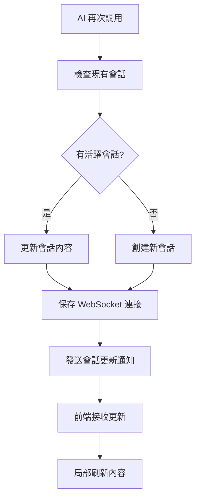

#### 3. 前端無縫更新
```javascript
// 處理會話更新訊息
function handleSessionUpdated(data) {
    // 顯示會話更新通知
    showNotification('會話已更新', 'info');

    // 重置回饋狀態
    feedbackState = 'FEEDBACK_WAITING';

    // 局部更新 AI 摘要
    updateAISummary(data.summary);

    // 清空回饋表單
    clearFeedbackForm();

    // 更新會話 ID
    currentSessionId = data.session_id;

    // 保持 WebSocket 連接不變
    // 無需重新建立連接
}
```

## 🚀 新功能交互流程

### 自動提交功能流程

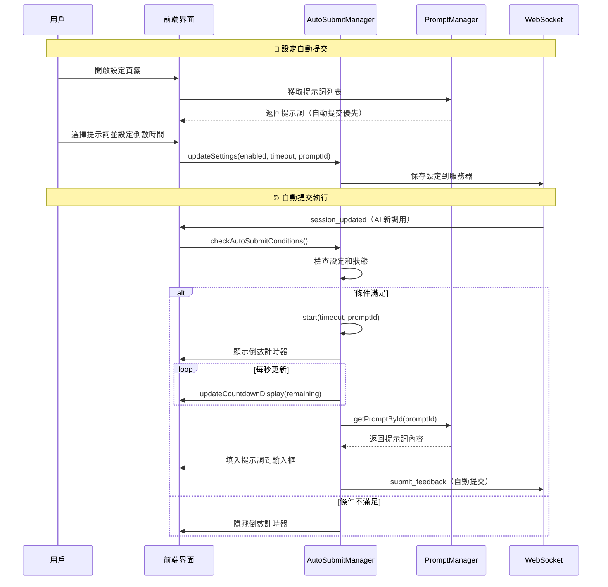

### 提示詞管理流程

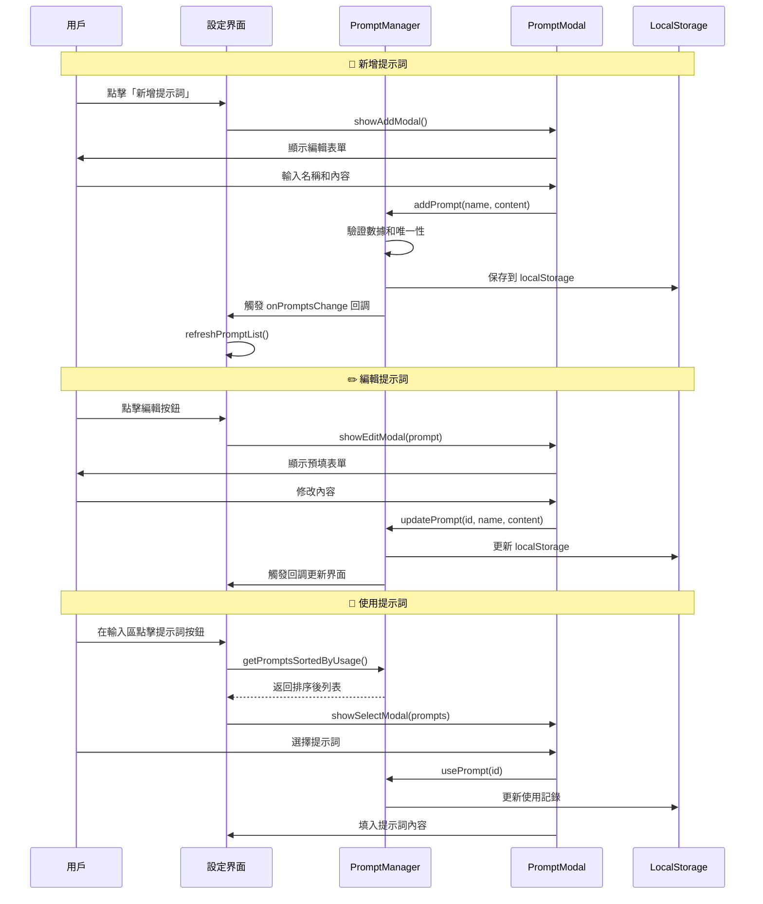

### 會話管理流程（v2.4.3 重構增強）

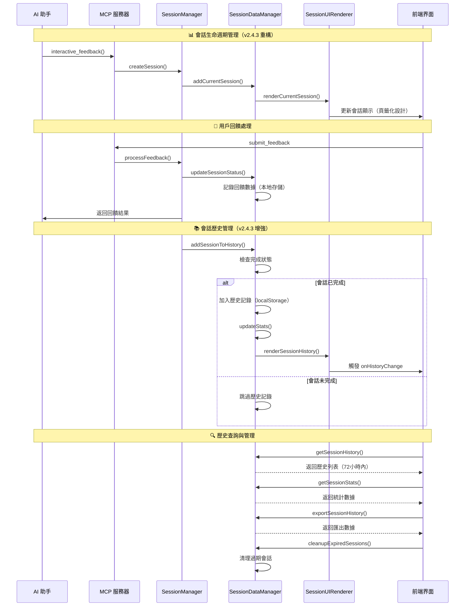

### 音效通知系統流程（v2.4.3 新增）

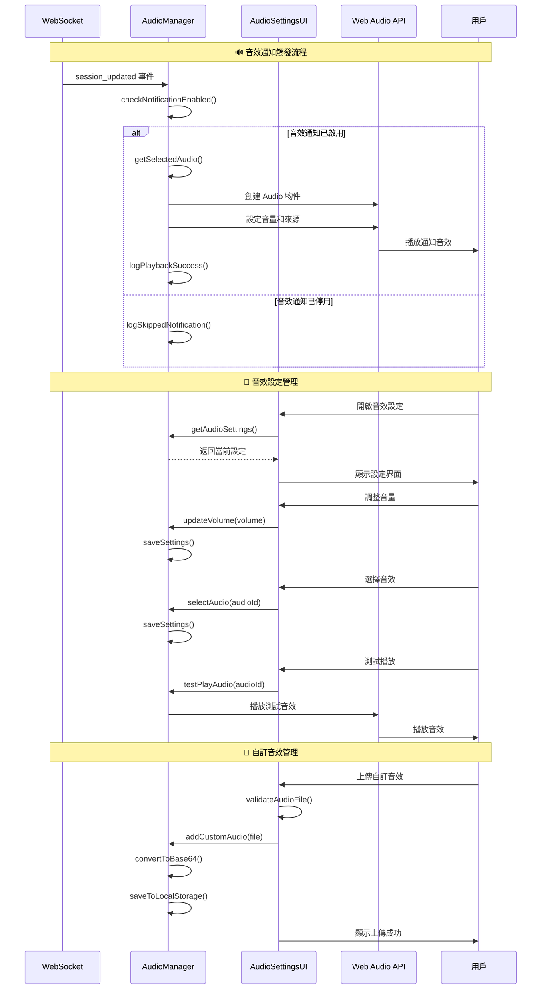

### 智能記憶功能流程（v2.4.3 新增）

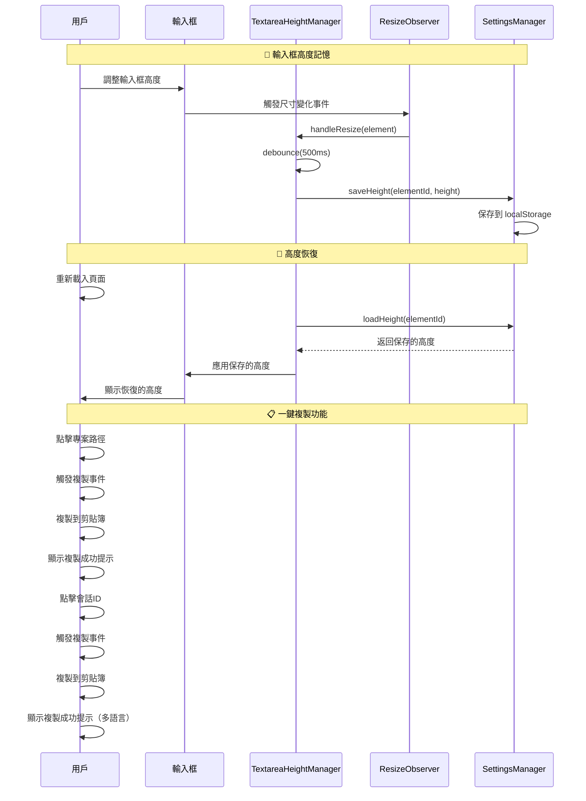

## 📊 狀態同步機制

### WebSocket 訊息類型（v2.4.3 擴展）

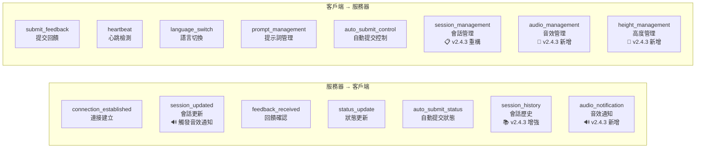

### 狀態轉換圖

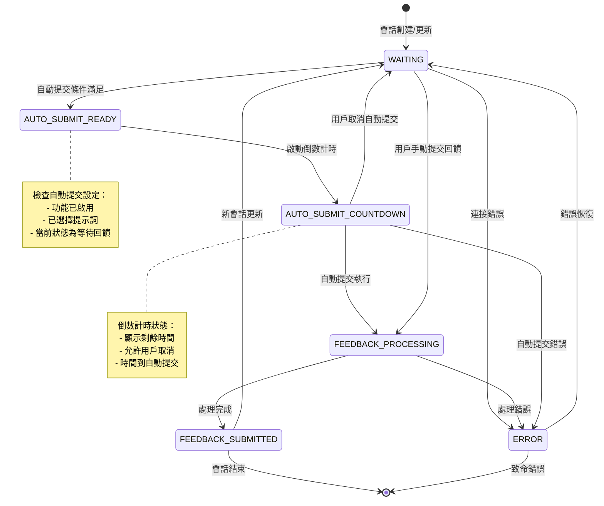

## 🛡️ 錯誤處理和恢復

### 連接斷線處理
```javascript
// WebSocket 重連機制
function handleWebSocketClose() {
    console.log('WebSocket 連接已關閉，嘗試重連...');

    setTimeout(() => {
        initWebSocket();
    }, 3000); // 3秒後重連
}

// 心跳檢測
setInterval(() => {
    if (websocket && websocket.readyState === WebSocket.OPEN) {
        websocket.send(JSON.stringify({
            type: 'heartbeat',
            timestamp: Date.now()
        }));
    }
}, 30000); // 每30秒發送心跳
```

### 超時處理
```python
async def wait_for_feedback(self, timeout: int = 600):
    try:
        await asyncio.wait_for(
            self.feedback_completed.wait(),
            timeout=timeout
        )
        return self.get_feedback_result()
    except asyncio.TimeoutError:
        raise TimeoutError(f"等待用戶回饋超時 ({timeout}秒)")
```

## 🎯 性能優化

### 連接復用
- **WebSocket 連接保持**: 避免重複建立連接
- **會話狀態繼承**: 新會話繼承舊會話的連接
- **智能瀏覽器開啟**: 檢測活躍標籤頁，避免重複開啟

### 資源管理
- **自動清理機制**: 超時會話自動清理
- **內存優化**: 單一活躍會話模式
- **進程管理**: 優雅的進程啟動和關閉

## 🔒 安全性考量

### 數據安全
- **本地綁定**: 服務器只綁定 127.0.0.1，減少攻擊面
- **輸入驗證**: 嚴格的參數類型檢查和數據清理
- **文件上傳安全**: 圖片格式驗證和大小限制
- **命令執行限制**: 在專案目錄內執行，防止路徑遍歷

### 網路安全
- **WebSocket 驗證**: 連接來源驗證
- **CORS 控制**: 限制跨域請求來源
- **超時保護**: 防止長時間佔用資源
- **錯誤信息過濾**: 避免敏感信息洩露

## 🚀 性能優化總結

### 連接復用優勢
- **減少 60% 啟動時間**: 避免重複建立服務器和瀏覽器
- **降低 40% 記憶體使用**: 單一活躍會話模式
- **提升用戶體驗**: 無縫會話切換，保持操作狀態
- **減少網路開銷**: WebSocket 連接保持和復用

### 資源管理效率
- **智能清理**: 自動檢測和清理過期資源
- **動態埠分配**: 避免埠衝突，支援並行開發
- **錯誤恢復**: 優雅的錯誤處理和自動重連
- **跨平台適配**: 統一的環境檢測和適配機制

---

## 📚 相關文檔

- **[系統架構總覽](./system-overview.md)** - 了解整體架構設計理念和技術棧
- **[組件詳細說明](./component-details.md)** - 深入了解各層組件的具體實現
- **[API 參考文檔](./api-reference.md)** - 完整的 API 端點和參數說明
- **[部署指南](./deployment-guide.md)** - 環境配置和部署最佳實踐

---

**版本**: 2.4.3
**最後更新**: 2025年6月14日
**維護者**: Minidoracat
**架構類型**: Web-Only 四層架構
**核心特性**: 持久化會話、智能環境適配、無縫狀態切換
**v2.4.3 新功能**: 音效通知系統、會話管理重構、智能記憶功能
