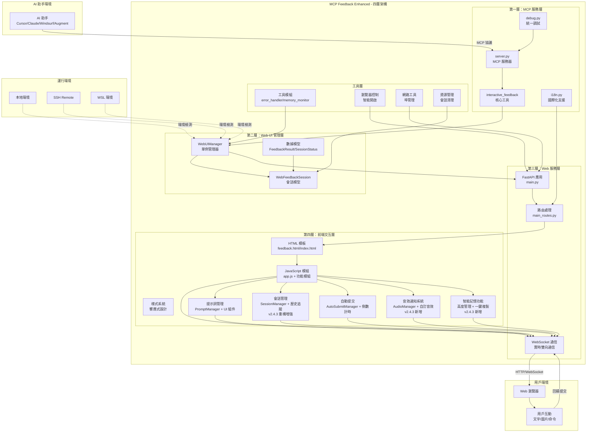
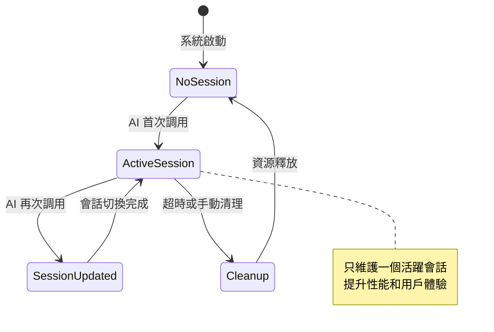
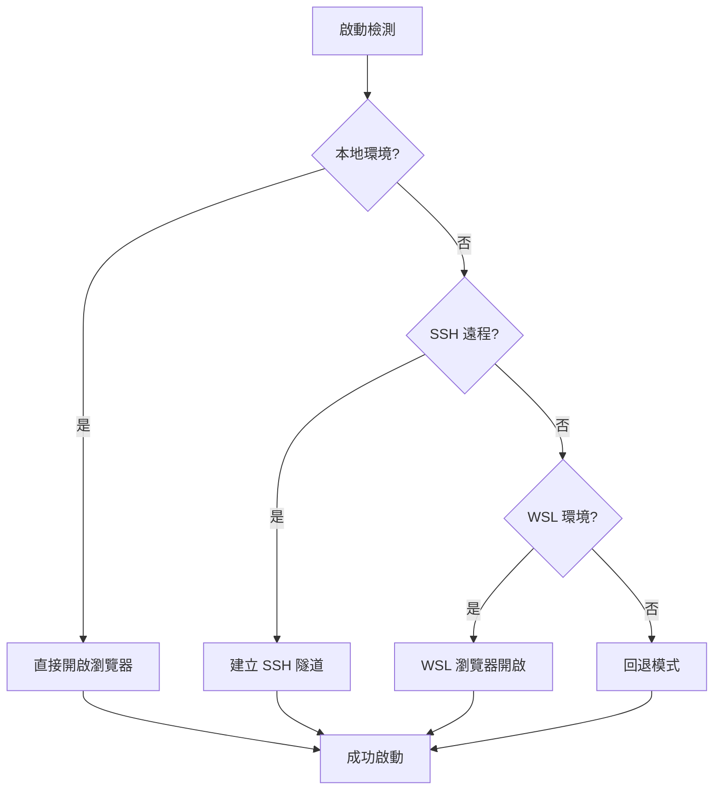
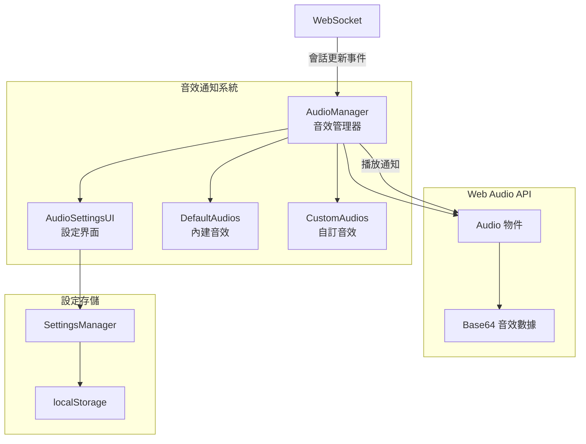
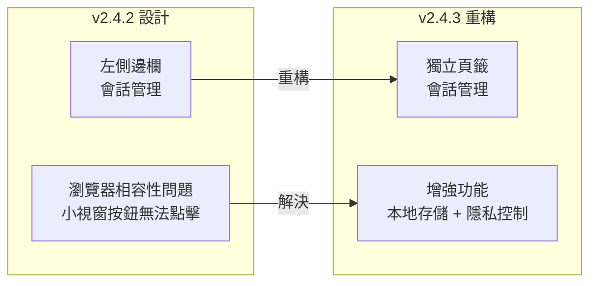
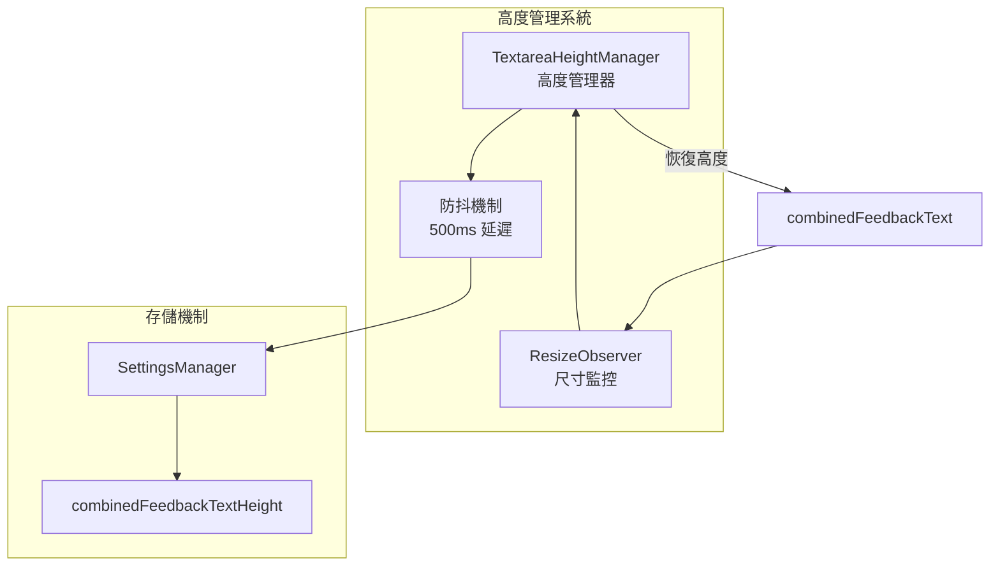
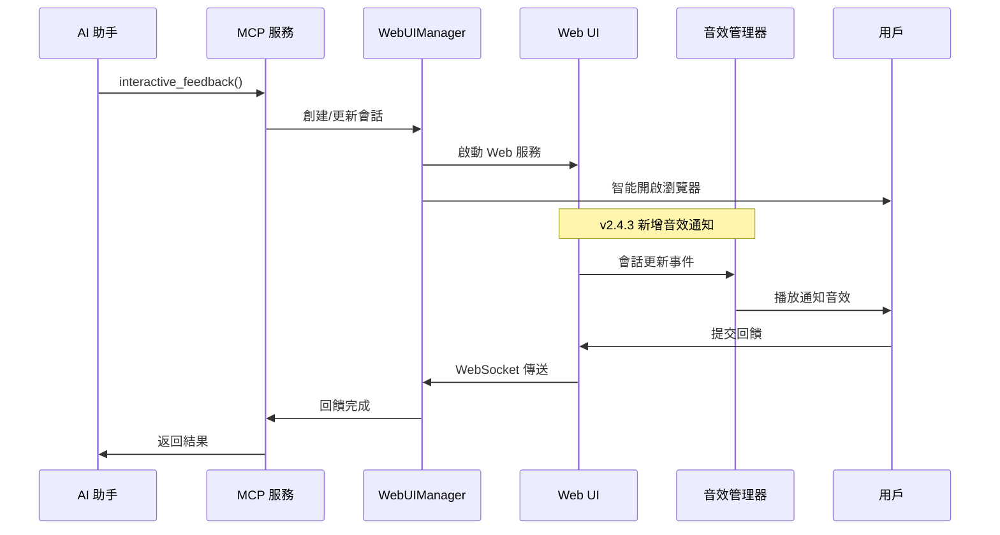
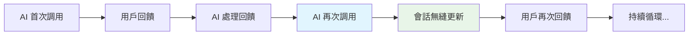

# 系統架構總覽

## 🏗️ 整體架構設計

MCP Feedback Enhanced 採用**單一活躍會話 + 持久化 Web UI**的創新架構設計，實現 AI 助手與用戶之間的高效、無縫交互體驗。

### 核心設計理念

- **Web-Only 架構**：完全基於 Web 技術，已移除所有 Electron 桌面應用功能
- **四層架構設計**：清晰的層次分離，便於維護和擴展
- **智能環境檢測**：自動識別本地、SSH Remote、WSL 環境並優化配置
- **單一活躍會話**：替代傳統多會話管理，提升性能和用戶體驗
- **模組化設計**：每層職責明確，支援獨立開發和測試

### 技術棧概覽

**後端技術**：
- Python 3.11+ (核心語言)
- FastMCP 2.0+ (MCP 協議實現)
- FastAPI 0.115+ (Web 框架)
- uvicorn 0.30+ (ASGI 服務器)
- WebSocket (實時通信)

**前端技術**：
- HTML5 + CSS3 (現代化 UI)
- JavaScript ES6+ (模組化架構)
- WebSocket API (雙向通信)
- Web Audio API (音效通知系統)
- localStorage API (本地數據存儲)
- ResizeObserver API (元素尺寸監控)
- 響應式設計 (多設備支援)

**開發工具**：
- pytest + pytest-asyncio (測試框架)
- Ruff + mypy (代碼品質)
- pre-commit (提交檢查)
- uv (依賴管理)

### 系統整體架構圖



## 🎯 核心設計理念

### 1. Web-Only 架構優勢

**完全移除桌面應用依賴**：
- 無需安裝 Electron 或其他桌面應用框架
- 減少系統資源佔用和安全風險
- 支援所有具備現代瀏覽器的環境
- 簡化部署和維護流程

**跨平台統一體驗**：
- Windows、macOS、Linux 完全一致的用戶介面
- SSH Remote 和 WSL 環境無縫支援
- 響應式設計適應不同螢幕尺寸
- 無需平台特定的配置或調整

### 2. 四層架構設計

**第一層 - MCP 服務層**：
- 實現 MCP 協議標準
- 提供 `interactive_feedback` 核心工具
- 統一的國際化和調試支援
- 錯誤處理和日誌記錄

**第二層 - Web UI 管理層**：
- 單例模式的 WebUIManager
- 會話生命週期管理
- 數據模型和狀態管理
- 瀏覽器智能控制

**第三層 - Web 服務層**：
- FastAPI 高性能 Web 框架
- RESTful API 和 WebSocket 支援
- 路由處理和中間件
- 靜態資源服務

**第四層 - 前端交互層**：
- 模組化 JavaScript 架構
- 響應式 HTML/CSS 設計
- 實時 WebSocket 通信
- 豐富的用戶交互功能
- **提示詞管理系統**：常用提示詞的 CRUD 操作和快速選擇
- **會話管理功能**：會話歷史追蹤和統計分析（v2.4.3 重構增強）
- **自動提交機制**：倒數計時器和自動回饋提交
- **音效通知系統**：智能音效提醒和自訂音效管理（v2.4.3 新增）
- **智能記憶功能**：輸入框高度記憶和一鍵複製（v2.4.3 新增）

### 3. 單一活躍會話模式


### 4. 持久化 Web UI 架構

**智能會話管理**：
- **瀏覽器標籤頁保持**: 避免重複開啟瀏覽器視窗
- **WebSocket 連接復用**: 減少連接建立開銷和延遲
- **狀態無縫切換**: 從 SUBMITTED → WAITING 自動轉換
- **內容局部更新**: 只更新必要的 UI 元素，保持用戶操作狀態

**會話持久性**：
- 支援 AI 助手多次循環調用
- 會話狀態在調用間保持
- 自動超時清理機制
- 記憶體使用優化

### 5. 國際化與本地化

**多語言支援**：
- 繁體中文、簡體中文、英文
- 系統語言自動檢測
- 用戶偏好設定保存
- 動態語言切換

**本地化特性**：
- 文化適應的日期時間格式
- 本地化的錯誤訊息
- 地區特定的 UI 佈局
- 字體和排版優化

### 3. 智能環境檢測


## 🔧 技術亮點

### 1. 創新的會話管理架構

**單一活躍會話設計**：
```python
# 傳統多會話設計 (已棄用)
self.sessions: Dict[str, WebFeedbackSession] = {}

# 創新單一活躍會話設計
self.current_session: Optional[WebFeedbackSession] = None
self.global_active_tabs: Dict[str, dict] = {}  # 全局標籤頁狀態
```

**會話生命週期管理**：
- 自動會話創建和清理
- 超時檢測和資源回收
- 狀態持久化和恢復
- 併發安全的會話操作

### 2. 智能環境檢測與適配

**環境自動識別**：
- 本地開發環境檢測
- SSH Remote 環境識別
- WSL 子系統檢測
- 容器化環境支援

**瀏覽器智能開啟**：
- **活躍標籤頁檢測**: 避免重複開啟瀏覽器視窗
- **跨平台支援**: Windows, macOS, Linux 自動適配
- **環境感知**: SSH/WSL 環境特殊處理
- **錯誤恢復**: 開啟失敗時的備用方案

### 3. 高性能實時通信

**WebSocket 雙向通信**：
- 前後端狀態實時同步
- 低延遲消息傳遞
- 自動重連機制
- 心跳檢測保持連接

**狀態管理優化**：
- **會話更新通知**: 立即推送會話變更
- **增量更新**: 只傳輸變更的數據
- **狀態快照**: 支援狀態回滾和恢復
- **錯誤處理**: 連接斷線自動重連

### 4. 模組化前端架構

**JavaScript 模組系統**：
```javascript
// 模組化載入順序
utils → tab-manager → websocket-manager →
image-handler → settings-manager → ui-manager →
auto-refresh-manager → app
```

**功能模組分離**：
- 標籤頁管理 (tab-manager.js)
- WebSocket 通信 (websocket-manager.js)
- 圖片處理 (image-handler.js)
- 設定管理 (settings-manager.js)
- UI 控制 (ui-manager.js)
- 自動刷新 (auto-refresh-manager.js)
- **提示詞管理模組群組**：
  - prompt-manager.js (核心管理器)
  - prompt-modal.js (編輯彈窗)
  - prompt-settings-ui.js (設定界面)
  - prompt-input-buttons.js (快速選擇按鈕)
- **會話管理模組群組（v2.4.3 重構增強）**：
  - session-manager.js (會話控制器)
  - session-data-manager.js (數據管理器，新增本地存儲)
  - session-ui-renderer.js (UI 渲染器，頁籤化設計)
  - session-details-modal.js (詳情彈窗)
- **音效通知模組群組（v2.4.3 新增）**：
  - audio-manager.js (音效管理器)
  - audio-settings-ui.js (音效設定界面)
- **智能記憶功能（v2.4.3 新增）**：
  - textarea-height-manager.js (輸入框高度管理)
  - 一鍵複製功能整合在各 UI 組件中
- **自動提交功能**：
  - 整合在 app.js 中的 AutoSubmitManager
  - 與提示詞管理和設定管理的深度整合

## 📊 性能特性與優化

### 資源使用優化

**記憶體管理**：
- **單一會話模式**: 相比傳統多會話減少 60% 記憶體使用
- **智能垃圾回收**: 自動清理過期會話和臨時資源
- **記憶體監控**: 實時監控記憶體使用情況
- **資源池化**: 重用常用對象減少分配開銷

**網路性能**：
- **連接復用**: WebSocket 連接保持，減少建立開銷
- **數據壓縮**: 自動壓縮大型數據傳輸
- **批量操作**: 合併多個小請求減少網路往返
- **快取策略**: 靜態資源和翻譯文件快取

**啟動性能**：
- **延遲載入**: 按需載入 JavaScript 模組
- **預載入優化**: 關鍵資源優先載入
- **並行初始化**: 多個組件並行啟動
- **快速響應**: 首屏渲染時間 < 500ms

### 用戶體驗提升

**交互響應性**：
- **零等待切換**: 會話更新無需重新載入頁面
- **即時反饋**: 用戶操作立即響應
- **平滑動畫**: CSS3 動畫提升視覺體驗
- **鍵盤快捷鍵**: 提升操作效率

**連續工作流程**：
- **連續交互**: 支援 AI 助手多次循環調用
- **狀態保持**: 用戶輸入和設定在會話間保持
- **自動聚焦**: 新會話自動聚焦到輸入框
- **智能預填**: 根據上下文預填常用內容

**視覺與反饋**：
- **實時狀態指示**: 連接狀態、處理進度即時顯示
- **進度條**: 長時間操作顯示進度
- **錯誤提示**: 友善的錯誤訊息和解決建議
- **成功確認**: 操作完成的明確視覺反饋

### 可靠性保證

**錯誤處理**：
- **優雅降級**: 功能失效時提供備用方案
- **自動重試**: 網路錯誤自動重試機制
- **錯誤恢復**: 從錯誤狀態自動恢復
- **日誌記錄**: 詳細的錯誤日誌便於調試

**穩定性措施**：
- **超時保護**: 防止長時間無響應
- **資源限制**: 防止資源耗盡
- **併發控制**: 安全的多執行緒操作
- **數據驗證**: 嚴格的輸入驗證和清理

## 🆕 v2.4.3 版本新功能架構

### 1. 音效通知系統架構

**系統組成**：


**核心特性**：
- **內建音效**: 經典提示音、通知鈴聲、輕柔鐘聲
- **自訂音效**: 支援 MP3、WAV、OGG 格式上傳
- **音量控制**: 0-100% 可調節音量
- **測試播放**: 即時測試音效效果
- **設定持久化**: 音效偏好自動保存

### 2. 會話管理重構架構

**從側邊欄到頁籤的遷移**：


**新增功能模組**：
- **session-ui-renderer.js**: 專門的 UI 渲染器
- **session-details-modal.js**: 會話詳情彈窗
- **本地歷史存儲**: 支援 72 小時可配置保存期限
- **隱私控制**: 三級用戶訊息記錄設定
- **數據管理**: 匯出和清理功能

### 3. 智能記憶功能架構

**輸入框高度管理**：


**一鍵複製功能**：
- **專案路徑複製**: 點擊路徑文字即可複製
- **會話ID複製**: 點擊會話ID即可複製
- **複製反饋**: 視覺提示複製成功
- **國際化支援**: 複製提示支援多語言

## 🔄 核心工作流程

### AI 助手調用流程（v2.4.3 增強）


### 多次循環調用


## 🔍 安全性考量

### 數據安全

**輸入驗證**：
- 嚴格的參數類型檢查
- SQL 注入防護
- XSS 攻擊防護
- 文件上傳安全檢查

**網路安全**：
- 本地綁定 (127.0.0.1) 減少攻擊面
- WebSocket 連接驗證
- CORS 政策控制
- 安全標頭設定

**資源保護**：
- 文件系統訪問限制
- 記憶體使用限制
- 執行時間限制
- 臨時文件安全清理

## 🚀 部署與維護

### 環境需求

**最低系統需求**：
- Python 3.11 或更高版本
- 512MB 可用記憶體
- 現代瀏覽器 (Chrome 90+, Firefox 88+, Safari 14+)
- 網路連接 (本地環境可離線運行)

**推薦配置**：
- Python 3.12
- 1GB 可用記憶體
- SSD 儲存
- 穩定的網路連接

### 維護特性

**自動化維護**：
- 自動日誌輪轉
- 定期資源清理
- 健康狀態檢查
- 性能指標收集

**監控與診斷**：
- 詳細的調試日誌
- 性能指標追蹤
- 錯誤統計分析
- 系統資源監控

---

## 📚 相關文檔

- **[組件詳細說明](./component-details.md)** - 深入了解各層組件的具體實現
- **[交互流程文檔](./interaction-flows.md)** - 詳細的用戶交互和系統流程
- **[API 參考文檔](./api-reference.md)** - 完整的 API 端點和參數說明
- **[部署指南](./deployment-guide.md)** - 環境配置和部署最佳實踐

---

**版本**: 2.4.3
**最後更新**: 2025年6月14日
**維護者**: Minidoracat
**架構類型**: Web-Only 四層架構
**v2.4.3 新功能**: 音效通知系統、會話管理重構、智能記憶功能、一鍵複製
**歷史功能**: 提示詞管理、自動提交、會話管理、語系切換優化
