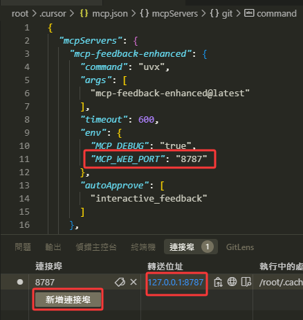
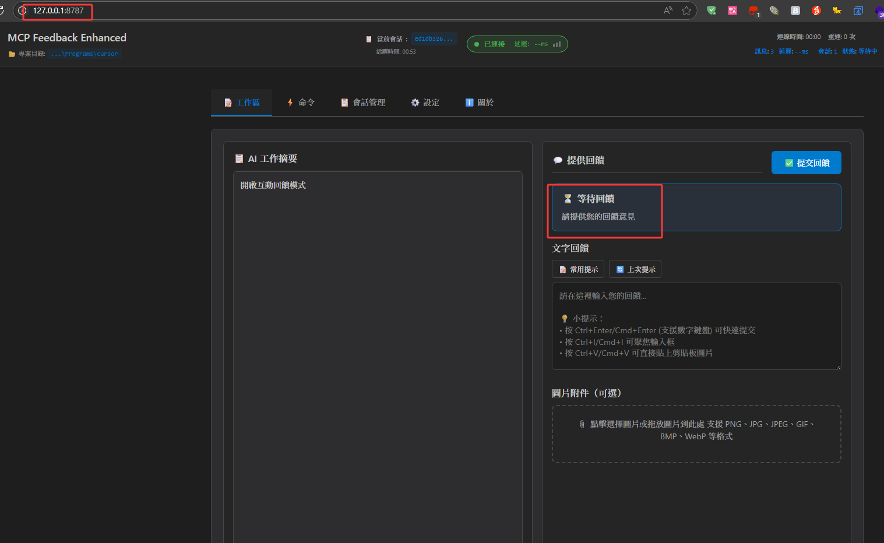
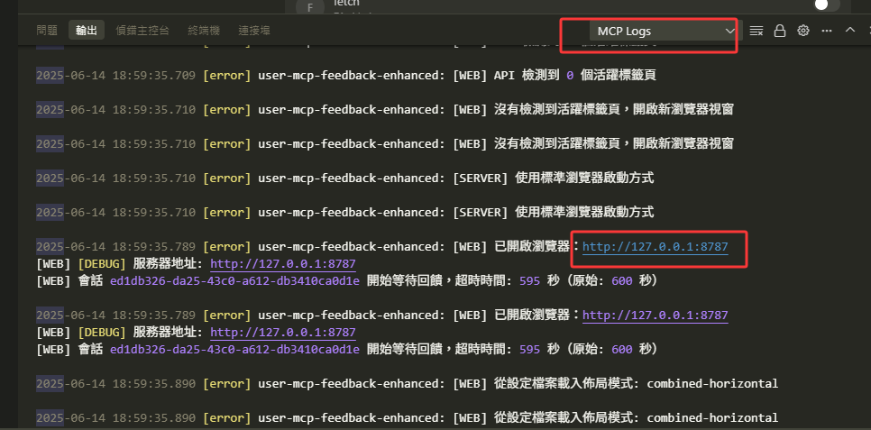

# SSH Remote Environment Browser Launch Issues Solution

## Problem Description

When using MCP Feedback Enhanced in SSH Remote environments (such as Cursor SSH Remote, VS Code Remote SSH, etc.), you may encounter the following issues:

- 🚫 Browser cannot launch automatically
- ❌ "Unable to launch browser" error message
- 🔗 Web UI cannot open in local browser

## Root Cause Analysis

SSH Remote environment limitations:
1. **Display Environment Isolation**: Remote server has no graphical interface environment
2. **Network Isolation**: Remote ports cannot be directly accessed locally
3. **No Browser Available**: Remote environments typically don't have browsers installed

## Solution

### Step 1: Configure Host and Port

You have to set `MCP_WEB_HOST` environment to `0.0.0.0` to allow port forwarding.

MCP Feedback Enhanced uses port **8765** by default, but you can customize the port:

### Step 2: Wait for MCP Call

**Important**: Do not manually start the Web UI. Instead, wait for the AI model to call the MCP tool to automatically start it.

When the AI model calls the `interactive_feedback` tool, the system will automatically start the Web UI.

### Step 3: Check Port and Connect

If the browser doesn't launch automatically, you need to manually connect to the Web UI:

#### Method 1: Check Port Forwarding
Check your SSH Remote environment's port forwarding settings to find the corresponding local port:

#### Method 2: Use Debug Mode
Enable Debug mode in your IDE, select "Output" → "MCP Log" to see the Web UI URL:

### Step 4: Open in Local Browser

1. Copy the URL (usually `http://localhost:8765` or another port)
2. Paste and open in your local browser
3. Start using the Web UI for feedback

## Port Forwarding Setup

### VS Code Remote SSH
1. Press `Ctrl+Shift+P` in VS Code
2. Type "Forward a Port"
3. Enter the port number (default 8765)
4. Access `http://localhost:8765` in your local browser

### Cursor SSH Remote
1. Check Cursor's port forwarding settings
2. Manually add port forwarding rule (port 8765)
3. Access the forwarded port in your local browser

## Important Reminders

### ⚠️ Do Not Start Manually
**Do NOT** manually execute commands like `uvx mcp-feedback-enhanced test --web`, as this cannot integrate with the MCP system.

### ✅ Correct Process
1. Wait for AI model to call MCP tool
2. System automatically starts Web UI
3. Check port forwarding or Debug logs
4. Open corresponding URL in local browser

## Frequently Asked Questions

### Q: Why can't the browser launch automatically in SSH Remote environment?
A: SSH Remote environment is headless with no graphical interface, so browsers cannot be launched directly. You need to access through port forwarding in your local browser.

### Q: How to confirm if Web UI started successfully?
A: Check IDE's Debug output or MCP Log. If you see "Web UI started" message, it means successful startup.

### Q: What if the port is occupied?
A: Modify the port number in MCP settings, or wait for the system to automatically select another available port.

### Q: Can't find port forwarding settings?
A: Check your SSH Remote tool documentation, or use Debug mode to view the URL in MCP Log.

### Q: Why am I not receiving new MCP feedback?
A: There might be a WebSocket connection issue. **Solution**: Simply refresh the browser page to re-establish the WebSocket connection.

### Q: Why isn't MCP being called?
A: Please confirm the MCP tool status shows green light (indicating normal operation). **Solution**:
- Check the MCP tool status indicator in your IDE
- If not green, try toggling the MCP tool on/off repeatedly
- Wait a few seconds for the system to reconnect

### Q: Why can't Augment start MCP?
A: Sometimes errors may prevent the MCP tool from showing green status. **Solution**:
- Completely close and restart VS Code or Cursor
- Reopen the project
- Wait for MCP tool to reload and show green light

## v2.3.0 Improvements

Improvements for SSH Remote environments in this version:
- ✅ Automatic SSH Remote environment detection
- ✅ Clear guidance when browser cannot launch
- ✅ Display correct access URL
- ✅ Improved error messages and solution suggestions

## Related Resources

- [Main Documentation](../../README.md)
